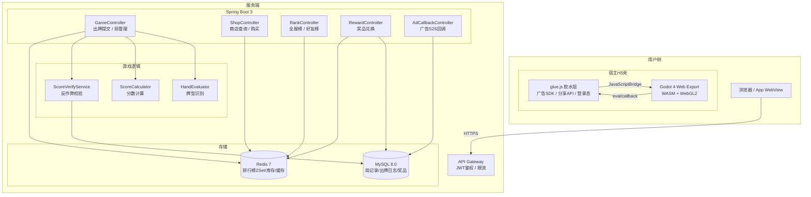
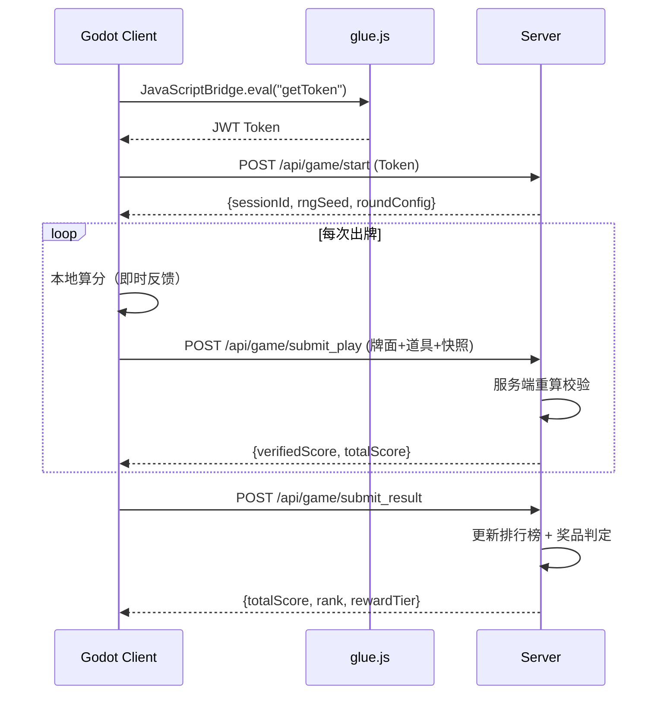
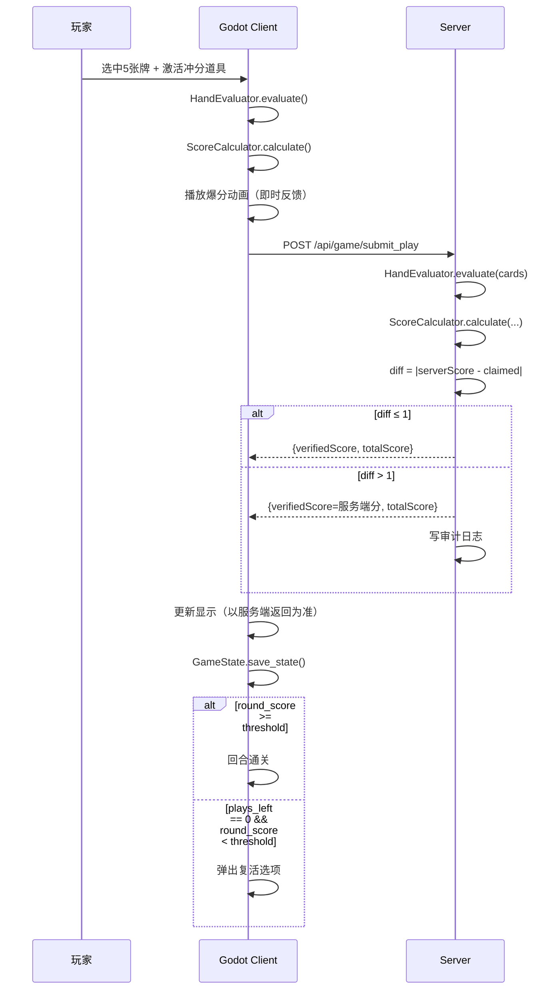
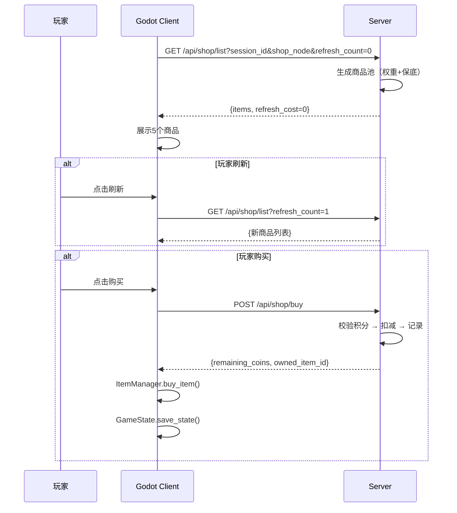
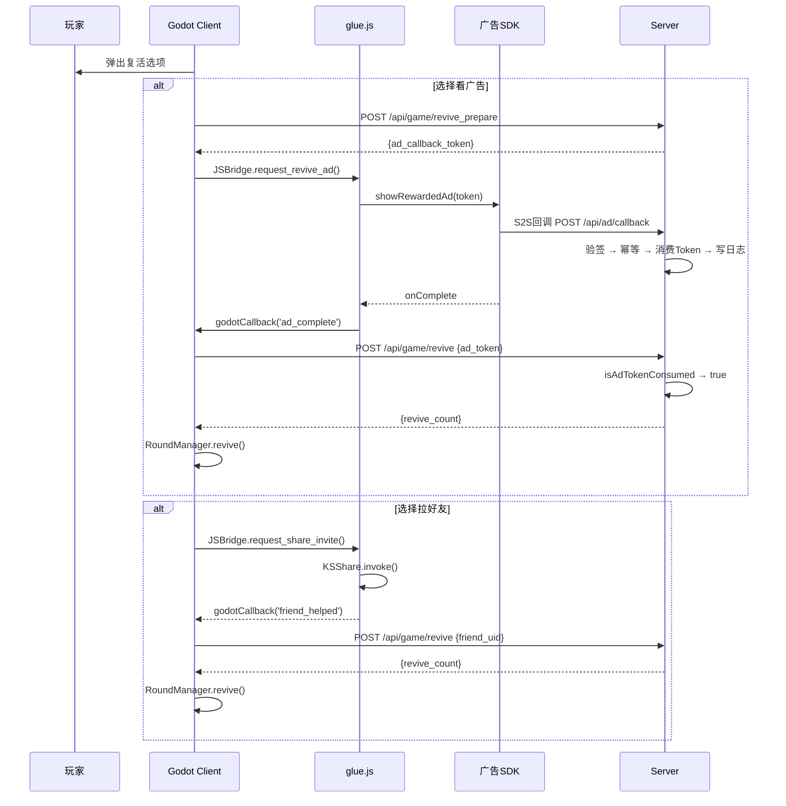
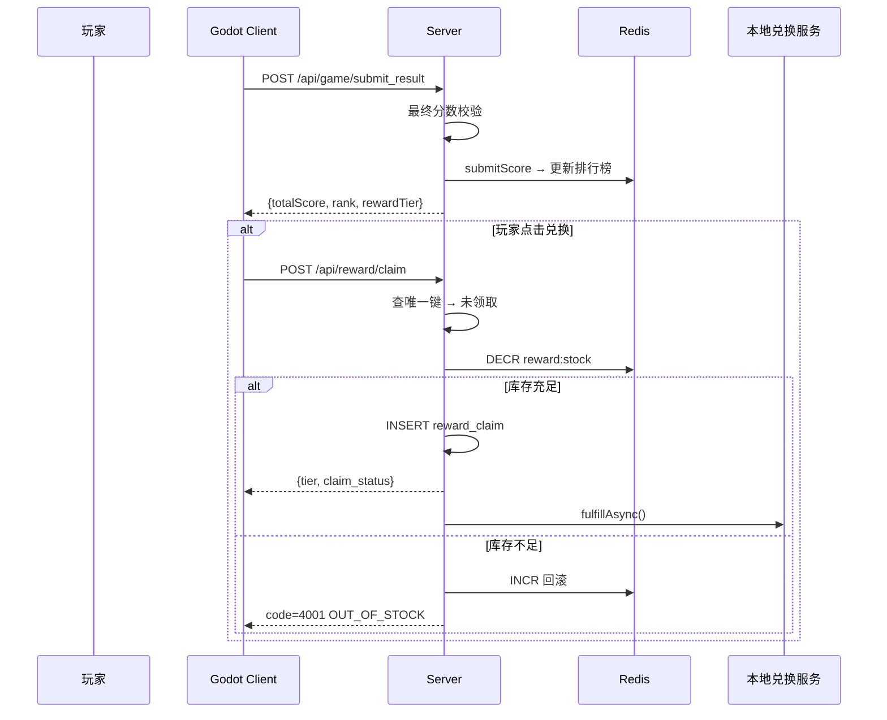
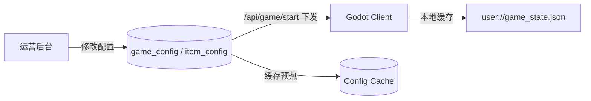

# 轻量级小丑牌 Roguelike 游戏——前后端整合技术方案

> 版本：v1.0 | 日期：2026-06-30 | 状态：初稿

---

## 第0章 架构总览

### 0.1 系统架构图



### 0.2 技术选型总表

| 层 | 技术 | 版本 | 说明 |
|---|---|---|---|
| 游戏引擎 | Godot | 4.3+ | GL Compatibility 模式，Web Export |
| 渲染 | WebGL2 | - | Compatibility 模式，移动端兼容性好 |
| 游戏脚本 | GDScript | 2.0 | Godot 原生，开发效率高 |
| 宿主壳 | HTML5 + JS | ES2020+ | 嵌入广告SDK/分享/登录 |
| 前后端通信 | JavaScriptBridge + HTTP | - | Godot↔JS 双向，JS↔后端 HTTP |
| 后端框架 | Spring Boot | 3.2.x | Java 17+ |
| ORM | MyBatis-Plus | 3.5.7 | 单表 CRUD 自动化 |
| 关系库 | MySQL | 8.0 | 局记录/日志/奖品 |
| 缓存 | Redis | 7.x | ZSet 排行榜 / 库存扣减 / 配置缓存 |
| 鉴权 | JWT | jjwt 0.12 | 无状态 Token，客户端注入 |

### 0.3 数据流概览



---

## 第1章 前端（Godot）详细设计

### 1.1 项目结构

```
res://
├── project.godot                  # 项目配置，Web Export 设置
├── export_presets.cfg             # Web 导出预设
│
├── scenes/
│   ├── Main.tscn                  # 根场景：场景切换管理
│   ├── GameBoard.tscn             # 主战斗界面
│   ├── Shop.tscn                  # 商店界面
│   ├── ResultScreen.tscn          # 结算界面
│   ├── Leaderboard.tscn           # 排行榜界面
│   └── ui/
│       ├── CardWidget.tscn        # 单张扑克牌 UI 组件
│       ├── ItemSlot.tscn          # 道具槽 UI 组件
│       ├── ScorePopup.tscn        # 分数飞字动画
│       ├── JokerCard.tscn         # 小丑牌展示卡片
│       └── ProgressBar.tscn       # 回合进度条（战斗分/门槛）
│
├── scripts/
│   ├── core/
│   │   ├── GameState.gd           # Autoload 全局状态单例
│   │   ├── RoundManager.gd        # 轮次/回合状态机
│   │   ├── DeckManager.gd         # 牌堆/手牌/弃牌区管理
│   │   ├── HandEvaluator.gd       # 牌型识别
│   │   ├── ScoreCalculator.gd     # 分数计算
│   │   ├── ItemManager.gd         # 道具持有/使用/效果管理
│   │   └── ConfigLoader.gd        # 远程配置加载（热更新）
│   ├── items/
│   │   ├── ItemEffect.gd          # 道具效果基类
│   │   ├── ItemResource.gd        # 道具数据 Resource
│   │   ├── jokers/
│   │   │   ├── JokerWealthy.gd    # 暴富小丑
│   │   │   ├── JokerChain.gd      # 连锁小丑
│   │   │   └── JokerBoom.gd       # 爆炸小丑
│   │   └── consumables/
│   │       ├── LuckySpark.gd      # 幸运火花
│   │       ├── CritPotion.gd      # 暴击药水
│   │       ├── DoublePotion.gd    # 双倍药水
│   │       ├── BossBurst.gd       # Boss 爆发
│   │       ├── FrenzyPotion.gd    # 狂热药水
│   │       ├── ExtraPlayTicket.gd # 额外出牌券
│   │       ├── FinalPlayTicket.gd # 终局出牌券
│   │       ├── ExtraDiscard.gd    # 额外换牌券
│   │       ├── RefreshTicket.gd   # 刷新券
│   │       ├── LuckyCompass.gd    # 幸运罗盘
│   │       ├── QuintCrit.gd       # 五连暴击（稀有）
│   │       └── RemainBoost.gd     # 余牌加持（稀有）
│   ├── ui/
│   │   ├── GameBoardUI.gd         # 战斗界面交互
│   │   ├── ShopUI.gd              # 商店界面交互
│   │   ├── ResultUI.gd            # 结算界面
│   │   └── CardDragDrop.gd        # 手牌拖拽/选择交互
│   └── net/
│       ├── GameAPI.gd             # HTTP 请求封装
│       └── JSBridge.gd            # JavaScriptBridge 封装
│
├── resources/
│   ├── items/                     # ItemResource .tres 文件
│   │   ├── joker_wealthy.tres
│   │   ├── joker_chain.tres
│   │   ├── joker_boom.tres
│   │   ├── lucky_spark.tres
│   │   └── ...
│   ├── round_configs/             # 回合门槛配置 .tres
│   │   └── default.tres
│   └── card_textures/             # 扑克牌面素材
│       ├── hearts/
│       ├── diamonds/
│       ├── clubs/
│       └── spades/
│
└── export/
    └── web/                       # Godot Web Export 输出
        ├── index.html
        ├── poker.game.wasm
        ├── poker.game.wasm.gz
        ├── poker.pck
        └── poker.pck.gz
```

### 1.2 牌堆系统（DeckManager）

#### 1.2.1 数据模型

```gdscript
# DeckManager.gd
class_name DeckManager
extends Node

class Card:
    var rank: int   # 1=A, 2-10, 11=J, 12=Q, 13=K
    var suit: int   # 0=♠ 1=♥ 2=♦ 3=♣
    
    func serialize() -> Dictionary:
        return {"r": rank, "s": suit}
    
    static func deserialize(d: Dictionary) -> Card:
        var c = Card.new()
        c.rank = d.r
        c.suit = d.s
        return c
    
    func _to_string() -> String:
        const RANKS = ["", "A", "2", "3", "4", "5", "6", "7", "8", "9", "10", "J", "Q", "K"]
        const SUITS = ["♠", "♥", "♦", "♣"]
        return RANKS[rank] + SUITS[suit]

const HAND_LIMIT = 8
const DECK_SIZE = 52

var deck: Array            = []   # 牌堆（待抽）
var hand: Array            = []   # 当前手牌
var discard_pile: Array    = []   # 弃牌区
```

#### 1.2.2 初始化与洗牌

```gdscript
func reset():
    deck.clear()
    hand.clear()
    discard_pile.clear()
    _init_standard_deck()
    _shuffle()

func _init_standard_deck():
    for suit in range(4):
        for rank in range(1, 14):
            deck.append(Card.new(rank, suit))

# Fisher-Yates 洗牌，O(n) 无偏
func _shuffle():
    var n = deck.size()
    for i in range(n - 1, 0, -1):
        var j = randi_range(0, i)
        var tmp = deck[i]
        deck[i] = deck[j]
        deck[j] = tmp

# 补手牌到上限
func draw_to_hand_limit():
    while hand.size() < HAND_LIMIT and deck.size() > 0:
        hand.append(deck.pop_back())
    # 牌堆耗尽：洗回弃牌区
    if deck.size() == 0 and discard_pile.size() > 0:
        deck = discard_pile.duplicate()
        discard_pile.clear()
        _shuffle()
        while hand.size() < HAND_LIMIT and deck.size() > 0:
            hand.append(deck.pop_back())
```

#### 1.2.3 出牌与换牌

```gdscript
# 出牌：从手牌移走选中的5张，放入弃牌区，补牌
func play_cards(selected_indices: Array) -> Array:
    assert(selected_indices.size() == 5, "必须选5张出牌")
    
    var sorted_idx = selected_indices.duplicate()
    sorted_idx.sort_custom(func(a, b): return a > b)
    
    var played: Array = []
    for idx in sorted_idx:
        played.append(hand[idx])
        hand.remove_at(idx)
    
    discard_pile.append_array(played)
    draw_to_hand_limit()
    return played

# 换牌：从手牌移走选中的牌，弃掉，补新牌
func discard_and_draw(selected_indices: Array) -> void:
    var sorted_idx = selected_indices.duplicate()
    sorted_idx.sort_custom(func(a, b): return a > b)
    
    for idx in sorted_idx:
        discard_pile.append(hand[idx])
        hand.remove_at(idx)
    
    draw_to_hand_limit()
```

### 1.3 牌型识别（HandEvaluator）

```gdscript
# HandEvaluator.gd
class_name HandEvaluator

enum HandRank {
    HIGH_CARD,       # 高牌    基础分 50
    ONE_PAIR,        # 一对    基础分 100
    TWO_PAIR,        # 两对    基础分 180
    THREE_OF_KIND,   # 三条    基础分 300
    STRAIGHT,        # 顺子    基础分 450
    FLUSH,           # 同花    基础分 600
    FULL_HOUSE,      # 葫芦    基础分 900
    FOUR_OF_KIND,    # 四条    基础分 1500
    STRAIGHT_FLUSH   # 同花顺  基础分 2500
}

const BASE_SCORES: Dictionary = {
    HandRank.HIGH_CARD:      50,
    HandRank.ONE_PAIR:       100,
    HandRank.TWO_PAIR:       180,
    HandRank.THREE_OF_KIND:  300,
    HandRank.STRAIGHT:       450,
    HandRank.FLUSH:          600,
    HandRank.FULL_HOUSE:     900,
    HandRank.FOUR_OF_KIND:   1500,
    HandRank.STRAIGHT_FLUSH: 2500,
}

static func evaluate(cards: Array) -> Dictionary:
    assert(cards.size() == 5, "出牌必须选 5 张")
    
    var ranks = []
    var suits = []
    for c in cards:
        ranks.append(c.rank)
        suits.append(c.suit)
    ranks.sort()
    
    var is_flush    = suits.count(suits[0]) == 5
    var is_straight = _check_straight(ranks)
    var count_map   = _count_ranks(ranks)
    var counts      = count_map.values()
    counts.sort()
    
    var hand_rank: HandRank
    if   is_flush and is_straight:           hand_rank = HandRank.STRAIGHT_FLUSH
    elif counts == [1, 4]:                   hand_rank = HandRank.FOUR_OF_KIND
    elif counts == [2, 3]:                   hand_rank = HandRank.FULL_HOUSE
    elif is_flush:                            hand_rank = HandRank.FLUSH
    elif is_straight:                         hand_rank = HandRank.STRAIGHT
    elif counts == [1, 1, 3]:                hand_rank = HandRank.THREE_OF_KIND
    elif counts == [1, 2, 2]:                hand_rank = HandRank.TWO_PAIR
    elif counts == [1, 1, 1, 2]:             hand_rank = HandRank.ONE_PAIR
    else:                                     hand_rank = HandRank.HIGH_CARD
    
    return {
        "rank": hand_rank,
        "base_score": BASE_SCORES[hand_rank],
    }

static func _check_straight(sorted_ranks: Array) -> bool:
    if sorted_ranks == [1, 2, 3, 4, 5]: return true
    if sorted_ranks == [1, 10, 11, 12, 13]: return true
    for i in range(1, sorted_ranks.size()):
        if sorted_ranks[i] - sorted_ranks[i - 1] != 1: return false
    return true

static func _count_ranks(ranks: Array) -> Dictionary:
    var map = {}
    for r in ranks:
        map[r] = map.get(r, 0) + 1
    return map
```

### 1.4 分数计算器（ScoreCalculator）

```gdscript
# ScoreCalculator.gd
class_name ScoreCalculator

static func calculate(
    hand_result: Dictionary,
    joker_states: Array,
    active_consumables: Array,
    remaining_hand: Array
) -> Dictionary:
    
    var base       = float(hand_result.base_score)
    var mult       = 1.0
    var crit_rate  = 0.0
    var crit_mult  = 2.0
    var special_mult = 1.0
    
    # 1. 小丑牌被动修正
    for js in joker_states:
        var delta = js.joker.get_passive_modifiers(hand_result)
        mult        += delta.get("mult_add", 0.0)
        crit_rate   += delta.get("crit_rate_add", 0.0)
        crit_mult   += delta.get("crit_mult_add", 0.0)
        special_mult *= delta.get("special_mult", 1.0)
    
    # 2. 冲分道具修正
    for item in active_consumables:
        var delta = item.get_score_modifiers()
        mult        *= delta.get("mult_factor", 1.0)
        mult        += delta.get("mult_add", 0.0)
        crit_rate   += delta.get("crit_rate_add", 0.0)
        crit_mult   += delta.get("crit_mult_add", 0.0)
    
    # 3. 余牌加持（稀有道具）
    var has_remain_boost = active_consumables.any(
        func(i): return i.resource.id == "remaining_boost"
    )
    if has_remain_boost and remaining_hand.size() > 0:
        var max_rank = 0
        for c in remaining_hand:
            if c.rank > max_rank: max_rank = c.rank
        var effective = max_rank
        if max_rank == 1: effective = 14  # A 当最高
        mult += float(effective)
    
    # 4. 暴击判断
    var is_crit = randf() < clampf(crit_rate, 0.0, 1.0)
    
    # 5. 最终分
    var score = base * mult
    if is_crit: score *= crit_mult
    score *= special_mult
    
    return {
        "score": int(score),
        "is_crit": is_crit,
        "mult": mult,
        "crit_mult": crit_mult if is_crit else 1.0,
        "special_mult": special_mult,
        "snapshot": {
            "hand_rank": hand_result.rank,
            "base_score": hand_result.base_score,
            "mult": snapped(mult, 0.0001),
            "is_crit": is_crit,
            "crit_mult": snapped(crit_mult, 0.0001),
            "special_mult": snapped(special_mult, 0.0001),
        }
    }

static func snapped(v: float, step: float) -> float:
    return snapped(v, step)
```

### 1.5 回合状态机（RoundManager）

```gdscript
# RoundManager.gd (Autoload)
class_name RoundManager
extends Node

enum Phase {
    ROUND_START,
    PLAYING,
    SHOP,
    ROUND_END,
    GAME_OVER,
    FINAL_RESULT
}

signal phase_changed(new_phase: Phase)
signal score_updated(round_score: int, total_score: int)
signal round_failed(round_idx: int, blind_idx: int)

const BLIND_NAMES = ["小盲", "大盲", "Boss"]

var current_round: int  = 0
var current_blind: int  = 0
var plays_left:    int  = 4
var discards_left: int  = 4
var round_score:   int  = 0
var total_score:   int  = 0
var revive_count:  int  = 0
var game_coins:    int  = 0
var play_log:      Array = []

# 门槛表（从远程配置加载）
var thresholds: Array = [
    [[300, 800, 1500],
     [1500, 3000, 5000],
     [3500, 6000, 10000]]
]

# 游戏积分奖励表
var coin_rewards: Array = [
    [[30, 50, 80],
     [50, 80, 120],
     [80, 120, 180]]
]

func start_new_game():
    current_round = 0
    current_blind = 0
    plays_left    = 4
    discards_left = 4
    round_score   = 0
    total_score   = 0
    revive_count  = 0
    game_coins    = 0
    play_log.clear()
    DeckManager.reset()
    ItemManager.reset()
    phase_changed.emit(Phase.ROUND_START)

func play_hand(selected_indices: Array, active_consumable_ids: Array) -> Dictionary:
    assert(plays_left > 0)
    
    var played_cards = DeckManager.play_cards(selected_indices)
    var remaining    = DeckManager.hand
    
    var hand_result = HandEvaluator.evaluate(played_cards)
    var active_items = active_consumable_ids.map(
        func(id): return ItemManager.get_consumable_by_id(id)
    )
    
    var score_result = ScoreCalculator.calculate(
        hand_result,
        ItemManager.get_active_joker_states(),
        active_items,
        remaining
    )
    
    var gained = score_result.score
    round_score += gained
    total_score += gained
    plays_left  -= 1
    
    for id in active_consumable_ids:
        ItemManager.consume_item(id)
    
    play_log.append({
        "round": current_round,
        "blind": current_blind,
        "play_idx": 4 - plays_left - 1,
        "cards": played_cards.map(func(c): return c.serialize()),
        "consumables": active_consumable_ids,
        "snapshot": score_result.snapshot,
        "claimed": gained
    })
    
    score_updated.emit(round_score, total_score)
    
    var threshold = thresholds[current_round][current_blind]
    if round_score >= threshold:
        _on_blind_cleared()
    elif plays_left == 0:
        round_failed.emit(current_round, current_blind)
    
    return score_result

func discard_cards(selected_indices: Array) -> bool:
    if discards_left <= 0: return false
    DeckManager.discard_and_draw(selected_indices)
    discards_left -= 1
    return true

func _on_blind_cleared():
    game_coins += coin_rewards[current_round][current_blind]
    
    if current_blind == 2:
        if current_round == 2:
            phase_changed.emit(Phase.FINAL_RESULT)
        else:
            current_round += 1
            current_blind  = 0
            _reset_blind()
            phase_changed.emit(Phase.ROUND_START)
    else:
        phase_changed.emit(Phase.SHOP)

func _reset_blind():
    round_score   = 0
    plays_left    = 4
    discards_left = 4
    DeckManager.reset()

func revive():
    revive_count += 1
    _reset_blind()
    phase_changed.emit(Phase.PLAYING)
```

### 1.6 道具系统（ItemManager）

#### 1.6.1 ItemResource 数据定义

```gdscript
# ItemResource.gd
class_name ItemResource
extends Resource

@export var id:            String
@export var display_name:  String
@export var description:   String
@export var icon:          Texture2D
@export var price:         int
@export var rarity:        int        # 0=普通 1=稀有
@export var item_type:     int        # 0=小丑牌 1=冲分道具
@export var shop_weight:   float
@export var effect_class:  String
```

#### 1.6.2 ItemEffect 基类

```gdscript
# ItemEffect.gd
class_name ItemEffect

var resource: ItemResource

func _init(res: ItemResource = null):
    resource = res

func get_passive_modifiers(_hand_result: Dictionary) -> Dictionary:
    return {}

func get_score_modifiers() -> Dictionary:
    return {}

func is_round_wide() -> bool:
    return false

func is_consumed() -> bool:
    return false
```

#### 1.6.3 小丑牌实现

```gdscript
# JokerWealthy.gd — 暴富小丑
class_name JokerWealthy
extends ItemEffect

var level: int = 1

# Level 1: 暴击率+10%, 暴击倍率+0.5
# Level 2: 暴击率+18%, 暴击倍率+1.0
# Level 3: 暴击率+25%, 暴击倍率+1.5
func get_passive_modifiers(_hand_result: Dictionary) -> Dictionary:
    match level:
        1: return {"crit_rate_add": 0.10, "crit_mult_add": 0.5}
        2: return {"crit_rate_add": 0.18, "crit_mult_add": 1.0}
        3: return {"crit_rate_add": 0.25, "crit_mult_add": 1.5}
    return {}

func get_upgrade_cost() -> int:
    match level:
        1: return 40
        2: return 80
        _: return -1
```

```gdscript
# JokerChain.gd — 连锁小丑
class_name JokerChain
extends ItemEffect

var level: int = 1
var _consecutive: int = 0
var _last_hand_rank: int = -1

# Level 1: 连续同牌型每次+0.15倍率
# Level 2: 连续同牌型每次+0.25倍率
# Level 3: 连续同牌型每次+0.40倍率
func get_passive_modifiers(hand_result: Dictionary) -> Dictionary:
    var rank = hand_result.rank
    if rank == _last_hand_rank:
        _consecutive += 1
    else:
        _consecutive = 1
    _last_hand_rank = rank
    
    var bonus: float
    match level:
        1: bonus = 0.15 * _consecutive
        2: bonus = 0.25 * _consecutive
        3: bonus = 0.40 * _consecutive
        _: bonus = 0.0
    return {"mult_add": bonus}

func get_upgrade_cost() -> int:
    match level:
        1: return 50
        2: return 100
        _: return -1
```

```gdscript
# JokerBoom.gd — 爆炸小丑
class_name JokerBoom
extends ItemEffect

var level: int = 1

# Level 1: 3%概率战斗分×10
# Level 2: 5%概率战斗分×15
# Level 3: 8%概率战斗分×20
func get_passive_modifiers(_hand_result: Dictionary) -> Dictionary:
    var prob: float
    var mult: float
    match level:
        1: prob = 0.03; mult = 10.0
        2: prob = 0.05; mult = 15.0
        3: prob = 0.08; mult = 20.0
        _: prob = 0.0; mult = 1.0
    if randf() < prob:
        return {"special_mult": mult}
    return {"special_mult": 1.0}

func get_upgrade_cost() -> int:
    match level:
        1: return 60
        2: return 120
        _: return -1
```

#### 1.6.4 冲分道具示例

```gdscript
# LuckySpark.gd — 幸运火花
class_name LuckySpark
extends ItemEffect
func get_score_modifiers() -> Dictionary:
    return {"crit_rate_add": 0.20}
func is_consumed() -> bool:
    return true

# DoublePotion.gd — 双倍药水
class_name DoublePotion
extends ItemEffect
func get_score_modifiers() -> Dictionary:
    return {"mult_factor": 2.0}
func is_consumed() -> bool:
    return true

# QuintCrit.gd — 五连暴击（稀有，整回合生效）
class_name QuintCrit
extends ItemEffect
func get_score_modifiers() -> Dictionary:
    return {"crit_rate_add": 1.0}
func is_round_wide() -> bool:
    return true
func is_consumed() -> bool:
    return false  # 由 ItemManager 回合结束时标记
```

#### 1.6.5 ItemManager 管理器

```gdscript
# ItemManager.gd (Autoload)
class_name ItemManager
extends Node

var jokers: Array = []
var consumables: Array = []

func reset():
    jokers.clear()
    consumables.clear()

func buy_item(item_res: ItemResource) -> bool:
    if RoundManager.game_coins < item_res.price: return false
    RoundManager.game_coins -= item_res.price
    var effect = _create_effect(item_res)
    if item_res.item_type == 0:
        jokers.append(effect)
    else:
        consumables.append(effect)
    return true

func get_active_joker_states() -> Array:
    return jokers

func get_consumable_by_id(id: String) -> ItemEffect:
    for item in consumables:
        if item.resource.id == id: return item
    return null

func consume_item(id: String):
    for i in range(consumables.size() - 1, -1, -1):
        if consumables[i].resource.id == id and consumables[i].is_consumed():
            consumables.remove_at(i)
            return

func on_round_end():
    for i in range(consumables.size() - 1, -1, -1):
        if consumables[i].is_round_wide():
            consumables.remove_at(i)

func upgrade_joker(joker: ItemEffect) -> bool:
    if joker.level >= 3: return false
    var cost = joker.get_upgrade_cost()
    if RoundManager.game_coins < cost: return false
    RoundManager.game_coins -= cost
    joker.level += 1
    return true

func _create_effect(res: ItemResource) -> ItemEffect:
    var script = load("res://scripts/items/%s.gd" % res.effect_class)
    var effect = script.new()
    effect.resource = res
    return effect
```

### 1.7 商店系统

#### 1.7.1 商店权重配置表

| 商品 | 基础权重 | 类型 | 稀有度 | R1小盲 | R1大盲 | R2小盲 | R2大盲 | R3小盲 | R3大盲 |
|------|---------|------|--------|--------|--------|--------|--------|--------|--------|
| 暴富小丑 | 30 | 小丑 | 0 | ✅30 | ✅25 | ✅20 | ✅15 | ✅10 | ✅5 |
| 连锁小丑 | 25 | 小丑 | 0 | ✅20 | ✅25 | ✅25 | ✅20 | ✅15 | ✅10 |
| 爆炸小丑 | 15 | 小丑 | 0 | ✅10 | ✅12 | ✅15 | ✅18 | ✅15 | ✅10 |
| 幸运火花 | 40 | 冲分 | 0 | ✅40 | ✅35 | ✅30 | ✅25 | ✅20 | ✅15 |
| 暴击药水 | 35 | 冲分 | 0 | ✅35 | ✅35 | ✅30 | ✅30 | ✅25 | ✅20 |
| 双倍药水 | 30 | 冲分 | 0 | ✅30 | ✅30 | ✅30 | ✅30 | ✅30 | ✅30 |
| Boss爆发 | 20 | 冲分 | 0 | ❌ | ✅15 | ❌ | ✅18 | ❌ | ✅20 |
| 狂热药水 | 20 | 冲分 | 0 | ❌ | ✅10 | ✅12 | ✅15 | ✅18 | ✅20 |
| 额外出牌券 | 25 | 冲分 | 0 | ✅20 | ✅22 | ✅25 | ✅25 | ✅25 | ✅25 |
| 终局出牌券 | 10 | 冲分 | 0 | ❌ | ❌ | ❌ | ✅8 | ❌ | ✅10 |
| 额外换牌券 | 30 | 冲分 | 0 | ✅25 | ✅25 | ✅25 | ✅25 | ✅25 | ✅25 |
| 刷新券 | 35 | 冲分 | 0 | ✅30 | ✅30 | ✅30 | ✅30 | ✅30 | ✅30 |
| 幸运罗盘 | 15 | 冲分 | 0 | ❌ | ✅10 | ✅12 | ✅15 | ✅18 | ✅20 |
| 五连暴击 | 3 | 冲分 | 1 | ❌ | ❌ | ❌ | ✅2 | ✅3 | ✅5 |
| 余牌加持 | 3 | 冲分 | 1 | ❌ | ❌ | ❌ | ✅2 | ✅3 | ✅5 |

**幸运罗盘**：使用后下次商店刷新时所有稀有道具权重 ×10。
**刷新券**：下次商店刷新免费。

#### 1.7.2 刷新费用递增

```
刷新次数    费用
0(首次)    0（免费）/ 刷新券
1          5
2          10
3          15
4          20
...        5 + (n-1) × 5
```

#### 1.7.3 稀有保底

连续3次商店刷新未出现稀有道具时，下次刷新第一个槽位必出稀有。

### 1.8 JS Bridge 层

```gdscript
# JSBridge.gd (Autoload)
extends Node

signal revive_ad_completed
signal revive_friend_helped
signal token_received(token: String)

func request_revive_ad():
    if OS.has_feature("web"):
        JavaScriptBridge.eval("window.GameBridge.showRewardedAd('revive')")
    else:
        revive_ad_completed.emit()  # 开发 fallback

func request_share_invite():
    if OS.has_feature("web"):
        JavaScriptBridge.eval("window.GameBridge.shareInvite()")
    else:
        revive_friend_helped.emit()

func get_auth_token() -> String:
    if OS.has_feature("web"):
        return JavaScriptBridge.eval("window.GameBridge.getToken() || ''")
    return "dev_token"

func dispatch(event: String, data_json: String):
    var data = JSON.parse_string(data_json) if data_json else {}
    match event:
        "ad_complete":   revive_ad_completed.emit()
        "ad_fail":       pass
        "friend_helped": revive_friend_helped.emit()
        "token_ready":   token_received.emit(data.get("token", ""))
```

```javascript
// glue.js
window.GameBridge = {
    showRewardedAd(scene) {
        if (window.KSAdSDK) {
            KSAdSDK.showRewardedVideo({
                scene,
                onComplete: () => window.godotCallback('ad_complete', { scene }),
                onFail: (err) => window.godotCallback('ad_fail', { err: String(err) })
            });
        }
    },
    shareInvite() {
        if (window.KSShare) {
            KSShare.invoke({
                type: 'game_invite',
                title: '帮我复活！小丑牌冲分中',
                onSuccess: () => window.godotCallback('friend_helped', {})
            });
        }
    },
    getToken() {
        return window.__GAME_TOKEN__ || '';
    }
};

window.GodotBridge_dispatch = function(event, dataJson) {
    if (window.Engine && typeof Engine.callMainMethod === 'function') {
        Engine.callMainMethod('JSBridge', 'dispatch', [event, dataJson || '{}']);
    }
};
```

### 1.9 本地缓存与断线恢复

```gdscript
# GameState.gd (Autoload)
class_name GameState
extends Node

const SAVE_PATH = "user://game_state.json"

func save_state():
    var state = {
        "session_id": GameAPI.session_id,
        "current_round": RoundManager.current_round,
        "current_blind": RoundManager.current_blind,
        "round_score": RoundManager.round_score,
        "total_score": RoundManager.total_score,
        "game_coins": RoundManager.game_coins,
        "plays_left": RoundManager.plays_left,
        "discards_left": RoundManager.discards_left,
        "revive_count": RoundManager.revive_count,
        "deck": DeckManager.deck.map(func(c): return c.serialize()),
        "hand": DeckManager.hand.map(func(c): return c.serialize()),
        "discard_pile": DeckManager.discard_pile.map(func(c): return c.serialize()),
        "jokers": RoundManager.jokers.map(func(j): return {"id": j.resource.id, "level": j.level}),
        "consumables": RoundManager.consumables.map(func(c): return c.resource.id),
        "play_log": RoundManager.play_log,
    }
    var file = FileAccess.open(SAVE_PATH, FileAccess.WRITE)
    file.store_string(JSON.stringify(state))
    file.close()

func load_state() -> bool:
    if not FileAccess.file_exists(SAVE_PATH): return false
    var file = FileAccess.open(SAVE_PATH, FileAccess.READ)
    var state = JSON.parse_string(file.get_as_text())
    file.close()
    if state == null: return false
    _restore_from_dict(state)
    return true

func clear_save():
    if FileAccess.file_exists(SAVE_PATH):
        DirAccess.remove_absolute(SAVE_PATH)
```

**保存时机**：每次出牌后、进入商店后、购买道具后、复活后、应用切后台时。

**断线恢复**：重新打开游戏时，优先从 localStorage 恢复。向服务端 `/api/game/start` 请求最新状态（sessionId 相同则续接），服务端对比 play_log 差异后补录。

---

## 第2章 前后端通信协议

### 2.1 HTTP 请求通用规范

| Header | 值 | 说明 |
|--------|---|------|
| `Authorization` | `Bearer {JWT}` | 鉴权 Token |
| `Content-Type` | `application/json` | 请求体格式 |
| `X-Request-Id` | UUID | 请求追踪，防重放 |
| `X-Client-Version` | `1.0.0` | 客户端版本号 |

### 2.2 接口定义

#### 2.2.1 POST /api/game/start

**请求**：
```json
{ "client_version": "1.0.0" }
```

**响应**：
```json
{
    "code": 0,
    "msg": "ok",
    "data": {
        "session_id": 10001,
        "rng_seed": 739251846293,
        "round_config": {
            "thresholds": [[300,800,1500],[1500,3000,5000],[3500,6000,10000]],
            "coin_rewards": [[30,50,80],[50,80,120],[80,120,180]],
            "max_revives": 3
        },
        "item_config": {
            "items": [
                {
                    "id": "joker_wealthy",
                    "display_name": "暴富小丑",
                    "description": "暴击率+10%，暴击倍率+0.5",
                    "price": 30,
                    "rarity": 0,
                    "item_type": 0,
                    "shop_weights": [30,25,20,15,10,5],
                    "upgrade_costs": [40,80],
                    "effect_class": "JokerWealthy",
                    "level_params": [
                        {"crit_rate_add":0.10,"crit_mult_add":0.5},
                        {"crit_rate_add":0.18,"crit_mult_add":1.0},
                        {"crit_rate_add":0.25,"crit_mult_add":1.5}
                    ]
                }
            ]
        },
        "reward_config": [
            {"min_score":0,"max_score":999,"reward_name":"参与奖","reward_type":"digital"},
            {"min_score":1000,"max_score":2999,"reward_name":"雪碧","reward_type":"drink"},
            {"min_score":3000,"max_score":5999,"reward_name":"奶茶","reward_type":"drink"},
            {"min_score":6000,"max_score":9999,"reward_name":"奶茶升级券","reward_type":"coupon"},
            {"min_score":10000,"max_score":-1,"reward_name":"稀有奖品","reward_type":"rare"}
        ]
    }
}
```

#### 2.2.2 POST /api/game/submit_play

**请求**：
```json
{
    "session_id": 10001,
    "round": 0,
    "blind": 1,
    "play_idx": 2,
    "cards": [{"r":1,"s":0},{"r":10,"s":1},{"r":11,"s":2},{"r":12,"s":3},{"r":13,"s":0}],
    "consumables": ["lucky_spark","double_potion"],
    "snapshot": {
        "hand_rank": 4,
        "base_score": 450,
        "mult": 2.0,
        "is_crit": true,
        "crit_mult": 2.5,
        "special_mult": 1.0
    },
    "claimed": 2250
}
```

**响应**：
```json
{
    "code": 0,
    "msg": "ok",
    "data": {
        "verified_score": 2250,
        "total_score": 4300,
        "is_crit": true
    }
}
```

#### 2.2.3 POST /api/game/submit_result

**请求**：
```json
{
    "session_id": 10001,
    "final_play_log": [...]
}
```

**响应**：
```json
{
    "code": 0,
    "msg": "ok",
    "data": {
        "total_score": 8500,
        "global_rank": 1234,
        "friend_rank": 5,
        "reward_tier": {"min_score":6000,"max_score":9999,"reward_name":"奶茶升级券","reward_type":"coupon"},
        "achievements": ["暴击大师"]
    }
}
```

#### 2.2.4 POST /api/game/revive

**请求**：
```json
{
    "session_id": 10001,
    "revive_type": 0,
    "ad_token": "ad_cb_abc123def456"
}
```

| 字段 | 类型 | 说明 |
|------|------|------|
| `revive_type` | int | 0=观看广告 1=拉好友 |
| `ad_token` | String | revive_type=0 时必填 |
| `friend_uid` | String | revive_type=1 时必填 |

#### 2.2.5 GET /api/shop/list

| 参数 | 类型 | 说明 |
|------|------|------|
| `session_id` | long | 当前局 ID |
| `shop_node` | int | 商店节点 0-5 |
| `refresh_count` | int | 当前已刷新次数 |

#### 2.2.6 POST /api/shop/buy

```json
{
    "session_id": 10001,
    "shop_node": 0,
    "item_id": "joker_wealthy",
    "slot_index": 0
}
```

#### 2.2.7 GET /api/rank/global

| 参数 | 类型 | 说明 |
|------|------|------|
| `page` | int | 页码，从 1 开始 |
| `size` | int | 每页条数，默认 20 |

#### 2.2.8 GET /api/rank/friends

同全服榜格式，增加 `is_self` 字段。

#### 2.2.9 POST /api/reward/claim

```json
{ "session_id": 10001 }
```

#### 2.2.10 POST /api/ad/callback（广告平台→服务端 S2S）

```json
{
    "callback_token": "ad_cb_abc123def456",
    "user_id": "u_001",
    "ad_type": "rewarded_video",
    "scene": "revive",
    "trans_id": "tx_789",
    "timestamp": 1782834000,
    "sign": "hmac_sha256_signature"
}
```

### 2.3 道具数据结构对齐（Godot ↔ Java）

| 概念 | Godot | Java | 对齐说明 |
|------|-------|------|---------|
| 道具 ID | `ItemResource.id` | `ItemDTO.id` | 完全一致 |
| 道具类型 | `ItemResource.item_type: int` | `ItemDTO.itemType: int` | 0=小丑牌 1=冲分道具 |
| 稀有度 | `ItemResource.rarity: int` | `ItemDTO.rarity: int` | 0=普通 1=稀有 |
| 商店权重 | `ItemResource.shop_weight` | `ItemDTO.shopWeights: float[]` | Java 下发6节点权重数组 |
| 效果类名 | `ItemResource.effect_class` | `ItemDTO.effectClass` | Godot load 脚本 / Java 反射 |
| 牌数据 | `Card.serialize() → {"r":1,"s":0}` | `CardDTO(rank, suit)` | r→rank，s→suit |
| 小丑牌状态 | `{id, level}` | `JokerStateDTO(id, level)` | 完全一致 |

### 2.4 错误码体系

| 错误码 | 常量名 | 说明 |
|--------|--------|------|
| 0 | SUCCESS | 成功 |
| 400 | PARAM_INVALID | 参数校验失败 |
| 401 | UNAUTHORIZED | Token 无效或过期 |
| 403 | FORBIDDEN | 无权限 |
| 1001 | SESSION_NOT_FOUND | 局记录不存在 |
| 1002 | SESSION_EXPIRED | 局已结束或超时 |
| 1003 | SESSION_USER_MISMATCH | 局不属于当前用户 |
| 1004 | REVIVE_LIMIT_EXCEEDED | 复活次数耗尽 |
| 1005 | AD_TOKEN_INVALID | 广告回调 token 无效 |
| 1006 | AD_TOKEN_EXPIRED | 广告 token 已过期（5分钟） |
| 1007 | AD_TOKEN_USED | 广告 token 已被消费 |
| 1008 | FRIEND_UID_INVALID | 好友 UID 无效 |
| 2001 | SCORE_CHEAT_DETECTED | 分数校验不通过 |
| 2002 | HAND_RANK_MISMATCH | 牌型不匹配 |
| 3001 | COINS_INSUFFICIENT | 游戏积分不足 |
| 3002 | ITEM_NOT_AVAILABLE | 道具不可购买 |
| 3003 | ITEM_ALREADY_OWNED | 小丑牌已拥有 |
| 4001 | REWARD_OUT_OF_STOCK | 奖品库存不足 |
| 4002 | REWARD_ALREADY_CLAIMED | 奖品已领取 |
| 4003 | REWARD_TIER_NOT_MATCHED | 分数未达任何奖品档位 |
| 5001 | CONFIG_LOAD_FAILED | 远程配置加载失败 |
| 9999 | INTERNAL_ERROR | 未知内部错误 |

---

## 第3章 后端详细设计

### 3.1 项目结构

```
poker-roguelike-server/
├── pom.xml
└── src/main/java/com/kuaishou/poker/
    ├── PokerApplication.java
    ├── controller/
    │   ├── GameController.java
    │   ├── ShopController.java
    │   ├── RankController.java
    │   ├── RewardController.java
    │   └── AdCallbackController.java
    ├── service/
    │   ├── GameService.java
    │   ├── ScoreVerifyService.java
    │   ├── ShopService.java
    │   ├── RankService.java
    │   ├── RewardService.java
    │   └── AdCallbackService.java
    ├── domain/
    │   ├── entity/
    │   │   ├── GameSession.java
    │   │   ├── PlayLog.java
    │   │   ├── RewardTier.java
    │   │   ├── RewardClaim.java
    │   │   ├── AdCallbackLog.java
    │   │   └── GameConfig.java
    │   ├── dto/
    │   │   ├── SubmitPlayRequest.java
    │   │   ├── StartGameResponse.java
    │   │   ├── ApiResult.java
    │   │   └── ItemDTO.java
    │   └── enums/
    │       ├── HandRank.java
    │       ├── SessionStatus.java
    │       └── ReviveType.java
    ├── game/
    │   ├── HandEvaluator.java
    │   ├── ScoreCalculator.java
    │   ├── model/
    │   │   ├── Card.java
    │   │   ├── HandResult.java
    │   │   ├── ScoreResult.java
    │   │   ├── PlaySnapshot.java
    │   │   └── ItemModifier.java
    │   └── registry/
    │       └── ItemModifierRegistry.java
    ├── mapper/
    │   ├── GameSessionMapper.java
    │   ├── PlayLogMapper.java
    │   └── AdCallbackLogMapper.java
    ├── infrastructure/
    │   ├── redis/
    │   │   ├── LeaderboardRedis.java
    │   │   └── StockRedis.java
    │   └── anti_cheat/
    │       └── ScoreAuditLogger.java
    └── config/
        ├── RedisConfig.java
        ├── SecurityConfig.java
        └── GlobalExceptionHandler.java
```

### 3.2 牌型识别（Java，与 GDScript 算法一致）

```java
// game/HandEvaluator.java
public class HandEvaluator {

    public enum HandRank {
        HIGH_CARD(0, 50),
        ONE_PAIR(1, 100),
        TWO_PAIR(2, 180),
        THREE_OF_KIND(3, 300),
        STRAIGHT(4, 450),
        FLUSH(5, 600),
        FULL_HOUSE(6, 900),
        FOUR_OF_KIND(7, 1500),
        STRAIGHT_FLUSH(8, 2500);

        public final int code;
        public final int baseScore;
        HandRank(int code, int baseScore) { this.code = code; this.baseScore = baseScore; }
    }

    public static HandResult evaluate(List<Card> cards) {
        if (cards.size() != 5) throw new IllegalArgumentException("必须选 5 张牌");

        int[] ranks = cards.stream().mapToInt(Card::getRank).sorted().toArray();
        int[] suits = cards.stream().mapToInt(Card::getSuit).toArray();
        boolean flush = isFlush(suits);
        boolean straight = isStraight(ranks);
        int[] counts = countRanks(ranks);

        HandRank rank;
        if      (flush && straight)                                        rank = HandRank.STRAIGHT_FLUSH;
        else if (hasCount(counts, 4))                                      rank = HandRank.FOUR_OF_KIND;
        else if (hasCount(counts, 3) && hasCount(counts, 2))              rank = HandRank.FULL_HOUSE;
        else if (flush)                                                   rank = HandRank.FLUSH;
        else if (straight)                                                rank = HandRank.STRAIGHT;
        else if (hasCount(counts, 3))                                     rank = HandRank.THREE_OF_KIND;
        else if (countOf(counts, 2) == 2)                                 rank = HandRank.TWO_PAIR;
        else if (countOf(counts, 2) == 1)                                 rank = HandRank.ONE_PAIR;
        else                                                              rank = HandRank.HIGH_CARD;

        return HandResult.builder().handRank(rank).baseScore(rank.baseScore).build();
    }

    private static boolean isFlush(int[] suits) {
        return Arrays.stream(suits).allMatch(s -> s == suits[0]);
    }

    private static boolean isStraight(int[] sorted) {
        if (Arrays.equals(sorted, new int[]{1, 2, 3, 4, 5})) return true;
        if (Arrays.equals(sorted, new int[]{1, 10, 11, 12, 13})) return true;
        for (int i = 1; i < sorted.length; i++) {
            if (sorted[i] - sorted[i - 1] != 1) return false;
        }
        return true;
    }

    private static int[] countRanks(int[] ranks) {
        Map<Integer, Long> map = Arrays.stream(ranks).boxed()
                .collect(Collectors.groupingBy(r -> r, Collectors.counting()));
        return map.values().stream().mapToInt(Long::intValue).sorted().toArray();
    }

    private static boolean hasCount(int[] counts, int target) {
        return Arrays.stream(counts).anyMatch(c -> c == target);
    }

    private static long countOf(int[] counts, int target) {
        return Arrays.stream(counts).filter(c -> c == target).count();
    }
}
```

### 3.3 分数计算与校验

```java
// service/ScoreVerifyService.java
@Service
@Slf4j
@RequiredArgsConstructor
public class ScoreVerifyService {

    private final GameSessionMapper sessionMapper;
    private final ScoreAuditLogger auditLogger;
    private static final int TOLERANCE = 1;

    public VerifyResult verify(SubmitPlayRequest req) {
        GameSession session = sessionMapper.selectById(req.getSessionId());
        if (session == null || !session.getUserId().equals(req.getUserId())) {
            throw new BizException(ErrorCode.SESSION_NOT_FOUND);
        }

        // 1. 服务端独立计算牌型
        HandResult handResult = HandEvaluator.evaluate(req.getCards());
        if (handResult.getHandRank().code != req.getSnapshot().getHandRank()) {
            auditLogger.logCheat(req, "hand_rank_mismatch",
                    handResult.getHandRank().code, req.getSnapshot().getHandRank());
            throw new BizException(ErrorCode.HAND_RANK_MISMATCH);
        }

        // 2. 重建小丑牌状态
        List<JokerState> jokers = buildJokerStates(session.getJokerStatesJson());

        // 3. 计算 RNG 种子
        long rngSeed = computeRngSeed(
            session.getRngSeed(), req.getRound(), req.getBlind(), req.getPlayIdx()
        );

        // 4. 服务端重算分数
        ScoreResult serverResult = ScoreCalculator.calculate(
            handResult, jokers, req.getConsumables(), rngSeed
        );

        // 5. 比对
        int diff = Math.abs(serverResult.getScore() - req.getClaimed());
        if (diff > TOLERANCE) {
            auditLogger.logCheat(req, "score_mismatch",
                    serverResult.getScore(), req.getClaimed());
            log.warn("Score mismatch uid={} claimed={} server={} diff={}",
                    req.getUserId(), req.getClaimed(), serverResult.getScore(), diff);
        }

        return VerifyResult.builder()
                .verifiedScore(serverResult.getScore())
                .isCrit(serverResult.isCrit())
                .diff(diff)
                .build();
    }

    // 每次出牌用不同子种子，防客户端预测暴击
    private long computeRngSeed(long baseSeed, int round, int blind, int playIdx) {
        return baseSeed ^ ((long) round << 16 | (long) blind << 8 | (long) playIdx);
    }
}
```

### 3.4 广告 S2S 回调服务

```java
// service/AdCallbackService.java
@Service
@Slf4j
@RequiredArgsConstructor
public class AdCallbackService {

    private final AdCallbackLogMapper callbackLogMapper;
    private final StringRedisTemplate redis;

    private static final String TOKEN_PREFIX = "ad:token:";
    private static final long TOKEN_TTL_SECONDS = 300;  // 5分钟

    /** 预生成广告回调 Token */
    public String generateAdToken(String userId, Long sessionId) {
        String token = "ad_cb_" + UUID.randomUUID().toString().replace("-", "");
        redis.opsForValue().set(
            TOKEN_PREFIX + token,
            userId + ":" + sessionId,
            Duration.ofSeconds(TOKEN_TTL_SECONDS)
        );
        return token;
    }

    /** 处理广告平台 S2S 回调（幂等） */
    @Transactional
    public void handleCallback(AdCallbackRequest req) {
        // 1. 验签
        if (!verifySign(req)) {
            throw new BizException(ErrorCode.AD_TOKEN_INVALID);
        }

        // 2. 幂等：同一 trans_id 只处理一次
        AdCallbackLog existing = callbackLogMapper.selectByTransId(req.getTransId());
        if (existing != null) return;

        // 3. 验证并消费 Token
        String key = TOKEN_PREFIX + req.getCallbackToken();
        String value = redis.opsForValue().get(key);
        if (value == null) {
            throw new BizException(ErrorCode.AD_TOKEN_EXPIRED);
        }
        redis.delete(key);  // 消费 Token，防重放

        String[] parts = value.split(":");
        if (!parts[0].equals(req.getUserId())) {
            throw new BizException(ErrorCode.AD_TOKEN_INVALID);
        }

        // 4. 写回调日志
        AdCallbackLog log = AdCallbackLog.builder()
                .transId(req.getTransId())
                .callbackToken(req.getCallbackToken())
                .userId(parts[0])
                .sessionId(Long.parseLong(parts[1]))
                .adType(req.getAdType())
                .scene(req.getScene())
                .createdAt(LocalDateTime.now())
                .build();
        callbackLogMapper.insert(log);
    }

    /** 复活时校验 Token 是否已被 S2S 回调消费 */
    public boolean isAdTokenConsumed(String callbackToken) {
        return !redis.hasKey(TOKEN_PREFIX + callbackToken);
    }

    private boolean verifySign(AdCallbackRequest req) {
        String data = req.getTransId() + req.getUserId()
                    + req.getCallbackToken() + req.getTimestamp();
        return HmacUtils.verify(data, req.getSign(), AD_SECRET_KEY);
    }
}
```

### 3.5 商店服务

```java
// service/ShopService.java
@Service
@RequiredArgsConstructor
public class ShopService {

    private final GameSessionMapper sessionMapper;
    private final StringRedisTemplate redis;
    private final ItemModifierRegistry itemRegistry;

    private static final String SHOP_STATE_PREFIX = "shop:state:";
    private static final int SHOP_SLOTS = 5;

    public ShopListResponse list(Long sessionId, int shopNode, int refreshCount) {
        String key = SHOP_STATE_PREFIX + sessionId + ":" + shopNode;
        String cached = redis.opsForValue().get(key);

        List<ItemDTO> items;
        if (cached != null && refreshCount == 0) {
            items = JSON.parseArray(cached, ItemDTO.class);
        } else {
            items = generateShopItems(shopNode);
            redis.opsForValue().set(key, JSON.toJSONString(items), Duration.ofMinutes(30));
        }

        return ShopListResponse.builder()
                .items(items)
                .refreshCost(calculateRefreshCost(refreshCount))
                .hasFreeRefresh(refreshCount == 0)
                .build();
    }

    @Transactional
    public BuyItemResponse buy(String userId, Long sessionId, int shopNode, String itemId) {
        GameSession session = sessionMapper.selectById(sessionId);
        ItemDTO itemConfig = itemRegistry.getConfig(itemId);

        // 检查已拥有
        if (itemConfig.getItemType() == 0 && isJokerOwned(session, itemId)) {
            throw new BizException(ErrorCode.ITEM_ALREADY_OWNED);
        }

        // 扣减积分
        if (session.getGameCoins() < itemConfig.getPrice()) {
            throw new BizException(ErrorCode.COINS_INSUFFICIENT);
        }
        sessionMapper.deductCoins(sessionId, itemConfig.getPrice());

        // 记录持有
        if (itemConfig.getItemType() == 0) {
            sessionMapper.addJoker(sessionId, itemId);
        }

        return BuyItemResponse.builder()
                .remainingCoins(session.getGameCoins() - itemConfig.getPrice())
                .ownedItemId(itemId)
                .build();
    }

    private List<ItemDTO> generateShopItems(int shopNode) {
        List<ItemDTO> pool = itemRegistry.getAllItems().stream()
                .filter(i -> i.getShopWeights()[shopNode] > 0)
                .collect(Collectors.toList());

        List<ItemDTO> selected = new ArrayList<>();
        for (int i = 0; i < SHOP_SLOTS && !pool.isEmpty(); i++) {
            ItemDTO picked = weightedPick(pool, shopNode);
            selected.add(picked);
            pool.remove(picked);
        }
        return selected;
    }

    private ItemDTO weightedPick(List<ItemDTO> pool, int shopNode) {
        double totalWeight = pool.stream()
                .mapToDouble(i -> i.getShopWeights()[shopNode]).sum();
        double roll = Math.random() * totalWeight;
        double cumulative = 0.0;
        for (ItemDTO item : pool) {
            cumulative += item.getShopWeights()[shopNode];
            if (roll <= cumulative) return item;
        }
        return pool.get(pool.size() - 1);
    }

    private int calculateRefreshCost(int refreshCount) {
        if (refreshCount == 0) return 0;
        return 5 + (refreshCount - 1) * 5;
    }
}
```

### 3.6 排行榜服务

```java
// infrastructure/redis/LeaderboardRedis.java
@Component
@RequiredArgsConstructor
public class LeaderboardRedis {

    private final StringRedisTemplate redisTemplate;
    private static final String KEY_GLOBAL = "rank:global";

    public void submitScore(String userId, long score) {
        String lua = """
            local cur = redis.call('ZSCORE', KEYS[1], ARGV[1])
            if cur == false or tonumber(cur) < tonumber(ARGV[2]) then
                redis.call('ZADD', KEYS[1], ARGV[2], ARGV[1])
                return 1
            end
            return 0
            """;
        redisTemplate.execute(
            new DefaultRedisScript<>(lua, Long.class),
            List.of(KEY_GLOBAL),
            userId, String.valueOf(score)
        );
    }

    public List<RankEntry> getGlobalTop(int page, int size) {
        int start = (page - 1) * size;
        Set<ZSetOperations.TypedTuple<String>> tuples =
                redisTemplate.opsForZSet()
                             .reverseRangeWithScores(KEY_GLOBAL, start, start + size - 1);
        return buildEntries(tuples, start + 1);
    }

    public long getMyGlobalRank(String userId) {
        Long rank = redisTemplate.opsForZSet().reverseRank(KEY_GLOBAL, userId);
        return rank == null ? -1L : rank + 1;
    }

    public List<RankEntry> getFriendsRank(String userId, List<String> friendIds) {
        List<String> allIds = new ArrayList<>(friendIds);
        allIds.add(userId);

        List<Object> scores = redisTemplate.executePipelined(
            (RedisCallback<Object>) conn -> {
                for (String uid : allIds) {
                    conn.zScore(KEY_GLOBAL.getBytes(), uid.getBytes());
                }
                return null;
            }
        );

        List<RankEntry> entries = new ArrayList<>();
        for (int i = 0; i < allIds.size(); i++) {
            Double score = (Double) scores.get(i);
            entries.add(RankEntry.builder()
                    .userId(allIds.get(i))
                    .score(score == null ? 0L : score.longValue())
                    .isSelf(allIds.get(i).equals(userId))
                    .build());
        }
        entries.sort(Comparator.comparingLong(RankEntry::getScore).reversed());
        for (int i = 0; i < entries.size(); i++) entries.get(i).setRank(i + 1);
        return entries;
    }

    private List<RankEntry> buildEntries(
            Set<ZSetOperations.TypedTuple<String>> tuples, int startRank) {
        if (tuples == null) return List.of();
        int rank = startRank;
        return tuples.stream().map(t -> RankEntry.builder()
                .userId(t.getValue())
                .score(t.getScore() == null ? 0L : t.getScore().longValue())
                .rank(rank++).build()).collect(Collectors.toList());
    }
}
```

### 3.7 奖品服务

```java
// service/RewardService.java
@Service
@Slf4j
@RequiredArgsConstructor
public class RewardService {

    private final GameSessionMapper sessionMapper;
    private final RewardTierMapper tierMapper;
    private final RewardClaimMapper claimMapper;
    private final StringRedisTemplate redis;

    private static final String STOCK_KEY = "reward:stock:";

    public RewardTier matchTier(long score) {
        return tierMapper.selectByScore(score);
    }

    @Transactional
    public ClaimResult claim(String userId, Long sessionId) {
        // 1. 防重复
        RewardClaim existing = claimMapper.selectByUserAndSession(userId, sessionId);
        if (existing != null) return ClaimResult.alreadyClaimed(existing);

        GameSession session = sessionMapper.selectById(sessionId);
        RewardTier tier = matchTier(session.getTotalScore());
        if (tier == null) return ClaimResult.noReward();

        // 2. Redis 原子库存扣减
        if (tier.getStockLimit() != -1) {
            Long remain = redis.opsForValue().decrement(STOCK_KEY + tier.getId());
            if (remain == null || remain < 0) {
                redis.opsForValue().increment(STOCK_KEY + tier.getId());
                return ClaimResult.outOfStock();
            }
        }

        // 3. 写领取记录（唯一键防并发重复）
        RewardClaim claim = RewardClaim.builder()
                .userId(userId).sessionId(sessionId).tierId(tier.getId())
                .status(ClaimStatus.PENDING.getCode()).build();
        try {
            claimMapper.insert(claim);
        } catch (DuplicateKeyException e) {
            if (tier.getStockLimit() != -1)
                redis.opsForValue().increment(STOCK_KEY + tier.getId());
            return ClaimResult.alreadyClaimed(null);
        }

        tierMapper.incrementStockUsed(tier.getId());

        // 4. 异步发货
        fulfillAsync(claim, tier);
        return ClaimResult.success(tier);
    }

    @Async
    public void fulfillAsync(RewardClaim claim, RewardTier tier) {
        try {
            localRewardClient.send(claim.getUserId(), tier.getRewardType(), tier.getRewardName());
            claimMapper.updateStatus(claim.getId(), ClaimStatus.FULFILLED.getCode());
        } catch (Exception e) {
            log.error("Reward fulfill failed claimId={}", claim.getId(), e);
            claimMapper.updateStatus(claim.getId(), ClaimStatus.FAILED.getCode());
        }
    }
}
```

---

## 第4章 数据库设计

### 4.1 完整 Schema

```sql
-- 游戏局记录
CREATE TABLE game_session (
    id               BIGINT PRIMARY KEY AUTO_INCREMENT,
    user_id          VARCHAR(64)  NOT NULL COMMENT '用户ID',
    start_time       DATETIME     NOT NULL,
    end_time         DATETIME,
    total_score      BIGINT       NOT NULL DEFAULT 0 COMMENT '三轮累计战斗分=排行榜积分',
    status           TINYINT      NOT NULL DEFAULT 0 COMMENT '0进行中 1完成 2放弃',
    rng_seed         BIGINT       NOT NULL COMMENT '服务端分配的随机种子',
    revive_count     TINYINT      NOT NULL DEFAULT 0 COMMENT '已使用复活次数',
    game_coins       INT          NOT NULL DEFAULT 0 COMMENT '当前游戏积分',
    joker_states     JSON         COMMENT '已拥有小丑牌状态',
    owned_consumables JSON        COMMENT '已拥有冲分道具ID列表',
    created_at       DATETIME     NOT NULL DEFAULT CURRENT_TIMESTAMP,
    updated_at       DATETIME     NOT NULL DEFAULT CURRENT_TIMESTAMP ON UPDATE CURRENT_TIMESTAMP,
    INDEX idx_user_id   (user_id),
    INDEX idx_score     (total_score DESC),
    INDEX idx_created   (created_at)
) ENGINE=InnoDB COMMENT='游戏局记录';

-- 出牌明细日志
CREATE TABLE play_log (
    id           BIGINT PRIMARY KEY AUTO_INCREMENT,
    session_id   BIGINT      NOT NULL,
    round_idx    TINYINT     NOT NULL COMMENT '轮次 0-2',
    blind_idx    TINYINT     NOT NULL COMMENT '回合 0=小盲 1=大盲 2=Boss',
    play_idx     TINYINT     NOT NULL COMMENT '第几次出牌 0-3',
    cards_json   JSON        NOT NULL COMMENT '5张牌',
    consumables  JSON        COMMENT '使用的冲分道具ID列表',
    score        INT         NOT NULL COMMENT '本次出牌战斗分',
    is_crit      TINYINT     NOT NULL DEFAULT 0 COMMENT '是否暴击',
    snapshot     JSON        NOT NULL COMMENT '客户端快照',
    server_score INT         COMMENT '服务端重算分数',
    diff         INT         COMMENT '客户端与服务端差值',
    created_at   DATETIME    NOT NULL DEFAULT CURRENT_TIMESTAMP,
    INDEX idx_session (session_id)
) ENGINE=InnoDB COMMENT='出牌日志';

-- 广告 S2S 回调日志
CREATE TABLE ad_callback_log (
    id              BIGINT PRIMARY KEY AUTO_INCREMENT,
    trans_id        VARCHAR(128) NOT NULL COMMENT '广告平台交易ID',
    callback_token  VARCHAR(128) NOT NULL COMMENT '服务端预生成的Token',
    user_id         VARCHAR(64)  NOT NULL,
    session_id      BIGINT       NOT NULL,
    ad_type         VARCHAR(32)  NOT NULL COMMENT '广告类型',
    scene           VARCHAR(32)  NOT NULL COMMENT '使用场景(如revive)',
    created_at      DATETIME     NOT NULL DEFAULT CURRENT_TIMESTAMP,
    UNIQUE KEY uk_trans_id (trans_id) COMMENT '幂等：同一交易只处理一次',
    INDEX idx_token (callback_token),
    INDEX idx_user_session (user_id, session_id)
) ENGINE=InnoDB COMMENT='广告回调日志';

-- 奖品档位配置
CREATE TABLE reward_tier (
    id           INT PRIMARY KEY AUTO_INCREMENT,
    min_score    BIGINT      NOT NULL,
    max_score    BIGINT      NOT NULL COMMENT '-1表示无上限',
    reward_name  VARCHAR(128) NOT NULL,
    reward_type  VARCHAR(32)  NOT NULL COMMENT 'drink/coupon/digital/rare',
    stock_limit  INT         NOT NULL DEFAULT -1 COMMENT '-1不限库存',
    stock_used   INT         NOT NULL DEFAULT 0,
    is_active    TINYINT     NOT NULL DEFAULT 1,
    INDEX idx_score_range (min_score, max_score)
) ENGINE=InnoDB COMMENT='奖品档位';

-- 奖品领取记录
CREATE TABLE reward_claim (
    id           BIGINT PRIMARY KEY AUTO_INCREMENT,
    user_id      VARCHAR(64) NOT NULL,
    session_id   BIGINT      NOT NULL,
    tier_id      INT         NOT NULL,
    status       TINYINT     NOT NULL DEFAULT 0 COMMENT '0待发放 1已发放 2失败',
    fail_reason  VARCHAR(256),
    created_at   DATETIME    NOT NULL DEFAULT CURRENT_TIMESTAMP,
    updated_at   DATETIME    NOT NULL DEFAULT CURRENT_TIMESTAMP ON UPDATE CURRENT_TIMESTAMP,
    UNIQUE KEY uk_user_session (user_id, session_id) COMMENT '同一局只能领一次'
) ENGINE=InnoDB COMMENT='奖品领取记录';

-- 游戏配置（热更新）
CREATE TABLE game_config (
    id           INT PRIMARY KEY AUTO_INCREMENT,
    config_key   VARCHAR(64) NOT NULL COMMENT '配置键',
    config_value JSON        NOT NULL COMMENT '配置值(JSON)',
    version      INT        NOT NULL DEFAULT 0 COMMENT '版本号，CAS更新',
    updated_at   DATETIME   NOT NULL DEFAULT CURRENT_TIMESTAMP ON UPDATE CURRENT_TIMESTAMP,
    UNIQUE KEY uk_key (config_key)
) ENGINE=InnoDB COMMENT='游戏配置';

-- 道具配置（热更新）
CREATE TABLE item_config (
    id           INT PRIMARY KEY AUTO_INCREMENT,
    item_id      VARCHAR(64) NOT NULL COMMENT '道具ID',
    config_data  JSON        NOT NULL COMMENT '道具完整配置',
    version      INT        NOT NULL DEFAULT 0,
    updated_at   DATETIME   NOT NULL DEFAULT CURRENT_TIMESTAMP ON UPDATE CURRENT_TIMESTAMP,
    UNIQUE KEY uk_item_id (item_id)
) ENGINE=InnoDB COMMENT='道具配置';
```

### 4.2 初始配置数据

```sql
-- 门槛与积分配置
INSERT INTO game_config (config_key, config_value) VALUES
('round_thresholds', '[[300,800,1500],[1500,3000,5000],[3500,6000,10000]]'),
('coin_rewards', '[[30,50,80],[50,80,120],[80,120,180]]'),
('max_revives', '3'),
('score_tolerance', '1'),
('shop_slot_count', '5'),
('refresh_cost_formula', '{"base":5,"increment":5}');

-- 奖品档位
INSERT INTO reward_tier (min_score, max_score, reward_name, reward_type, stock_limit) VALUES
(0,     999,   '参与奖',     'digital', -1),
(1000,  2999,  '雪碧',       'drink',   5000),
(3000,  5999,  '奶茶',       'drink',   3000),
(6000,  9999,  '奶茶升级券', 'coupon',  1000),
(10000, -1,    '稀有奖品',   'rare',    100);

-- 道具配置示例
INSERT INTO item_config (item_id, config_data) VALUES
('joker_wealthy', '{
    "display_name":"暴富小丑","description":"暴击率+10%，暴击倍率+0.5",
    "price":30,"rarity":0,"item_type":0,
    "shop_weights":[30,25,20,15,10,5],
    "upgrade_costs":[40,80],
    "effect_class":"JokerWealthy",
    "level_params":[
        {"crit_rate_add":0.10,"crit_mult_add":0.5},
        {"crit_rate_add":0.18,"crit_mult_add":1.0},
        {"crit_rate_add":0.25,"crit_mult_add":1.5}
    ]
}'),
('joker_chain', '{
    "display_name":"连锁小丑","description":"连续同牌型倍率提升",
    "price":40,"rarity":0,"item_type":0,
    "shop_weights":[25,25,25,20,15,10],
    "upgrade_costs":[50,100],
    "effect_class":"JokerChain",
    "level_params":[
        {"chain_mult":0.15},
        {"chain_mult":0.25},
        {"chain_mult":0.40}
    ]
}'),
('joker_boom', '{
    "display_name":"爆炸小丑","description":"低概率战斗分额外×10",
    "price":50,"rarity":0,"item_type":0,
    "shop_weights":[15,12,15,18,15,10],
    "upgrade_costs":[60,120],
    "effect_class":"JokerBoom",
    "level_params":[
        {"boom_prob":0.03,"boom_mult":10.0},
        {"boom_prob":0.05,"boom_mult":15.0},
        {"boom_prob":0.08,"boom_mult":20.0}
    ]
}');
```

---

## 第5章 关键业务流程

### 5.1 出牌流程



### 5.2 商店购买流程



### 5.3 复活流程



### 5.4 奖品兑换流程



---

## 第6章 配置与热更新

### 6.1 热更新架构

所有数值配置存放在 `game_config` 和 `item_config` 表中，随 `/api/game/start` 一起下发客户端。



### 6.2 配置加载流程（Godot）

```gdscript
# ConfigLoader.gd (Autoload)
class_name ConfigLoader
extends Node

var _round_config: Dictionary = {}
var _item_configs: Array = []
var _reward_configs: Array = []

func load_from_server(data: Dictionary):
    _round_config = data.get("round_config", {})
    _item_configs = data.get("item_config", {}).get("items", [])
    _reward_configs = data.get("reward_config", [])
    
    RoundManager.thresholds = _round_config.get("thresholds", RoundManager.thresholds)
    RoundManager.coin_rewards = _round_config.get("coin_rewards", RoundManager.coin_rewards)
    _rebuild_item_resources()
    _apply_reward_configs()

func _rebuild_item_resources():
    for item_data in _item_configs:
        var res = ItemResource.new()
        res.id = item_data.id
        res.display_name = item_data.display_name
        res.description = item_data.description
        res.price = item_data.price
        res.rarity = item_data.rarity
        res.item_type = item_data.item_type
        res.shop_weight = float(item_data.shop_weights[0])
        res.effect_class = item_data.effect_class
        ItemManager.register_item_resource(res)
```

### 6.3 配置更新规范

| 配置项 | 表 | 热更新 | 需发版 |
|--------|---|--------|--------|
| 门槛数值 | game_config | ✅ | ❌ |
| 游戏积分奖励 | game_config | ✅ | ❌ |
| 道具价格/权重 | item_config | ✅ | ❌ |
| 道具效果数值 | item_config | ✅ | ❌ |
| 奖品档位 | reward_tier | ✅ | ❌ |
| 最大复活次数 | game_config | ✅ | ❌ |
| 新增道具效果 | item_config | ✅（配置热更）| 需同步更新 Godot effect_class 脚本 |
| 错误码 | 代码 | ❌ | ✅ |

> 关键区分：新增道具的**配置**（ID、价格、权重）可热更新，但新**效果逻辑**（新 GDScript 类）需要客户端发版。

### 6.4 运营后台最小功能

| 功能 | 说明 |
|------|------|
| 修改门槛 | 调整9个回合的通关分数 |
| 修改积分奖励 | 调整各回合通关后发放的游戏积分 |
| 修改道具价格/权重 | 调整商店刷新概率和购买成本 |
| 修改奖品档位 | 调整分数段和对应奖品 |
| 设置库存 | 控制奖品发放上限 |
| 查看作弊审计 | 按 session_id 查询 diff > 1 的出牌日志 |
| 排行榜管理 | 查看/清空异常分数 |

---

## 第7章 部署与运维

### 7.1 Godot Web Export 部署

#### 7.1.1 构建流程

```bash
# 1. Godot 导出
godot --headless --export-release "Web" export/web/index.html

# 2. 预压缩
find export/web -name "*.wasm" -exec gzip -k -9 {} \;
find export/web -name "*.pck" -exec gzip -k -9 {} \;

# 3. 产物体积预估
# index.html          ~5KB
# poker.game.wasm     ~10MB → gzip 后 ~3.5MB
# poker.pck           ~5MB → gzip 后 ~2MB
```

#### 7.1.2 Nginx 配置

```nginx
server {
    listen 443 ssl;
    server_name game.example.com;

    # SharedArrayBuffer 必须设置
    add_header Cross-Origin-Opener-Policy "same-origin" always;
    add_header Cross-Origin-Embedder-Policy "require-corp" always;

    root /var/www/poker;

    location / {
        try_files $uri $uri/ /index.html;
    }

    location ~* \.(wasm|pck)$ {
        gzip_static on;
        types { application/wasm wasm; }
        expires 30d;
        add_header Cache-Control "public, immutable";
    }

    location ~* \.(js|html|css)$ {
        expires 1d;
        add_header Cache-Control "public";
    }
}
```

#### 7.1.3 首屏优化

```
Loading 流程：
1. 打开 H5 → HTML Loading 占位（~100ms）
2. 下载 WASM（~3.5MB gzip）+ PCK（~2MB gzip）→ 进度条
3. WASM 编译初始化 → Godot 引擎启动
4. 首场景加载 → 显示游戏主界面

优化：
- WASM/PCK 预压缩 + CDN 缓存
- HTML Loading 占位图（用户不看到白屏）
- 延迟加载：排行榜/结算场景用 load_async
- 音频：首次触摸解锁 AudioContext（移动端限制）
```

### 7.2 后端部署

```yaml
# docker-compose.yml
version: '3.8'
services:
  app:
    build: .
    ports: ["8080:8080"]
    environment:
      - SPRING_PROFILES_ACTIVE=prod
      - DB_HOST=mysql
      - REDIS_HOST=redis
      - JWT_SECRET=${JWT_SECRET}
      - AD_SECRET_KEY=${AD_SECRET_KEY}
    depends_on: [mysql, redis]
    restart: unless-stopped

  mysql:
    image: mysql:8.0
    environment:
      MYSQL_DATABASE: poker_game
      MYSQL_ROOT_PASSWORD: ${DB_PASS}
    volumes:
      - mysql_data:/var/lib/mysql
      - ./sql:/docker-entrypoint-initdb.d
    restart: unless-stopped

  redis:
    image: redis:7-alpine
    command: redis-server --requirepass ${REDIS_PASS}
    volumes: [redis_data:/data]
    restart: unless-stopped

volumes:
  mysql_data:
  redis_data:
```

JVM 参数：`-Xms512m -Xmx1g -XX:+UseG1GC -XX:MaxGCPauseMillis=100`

### 7.3 监控与告警

| 监控项 | 阈值 | 告警 |
|--------|------|------|
| submit_play P99 延迟 | > 500ms | 告警 |
| 分数校验 diff>1 比例 | > 5% | 告警（作弊或 Bug） |
| 排行榜 ZSet 大小 | > 100万 | 告警 |
| 奖品库存 | < 10% | 告警 |
| 广告回调失败率 | > 10% | 告警 |
| Redis 内存 | > 80% | 告警 |

---

## 附录

### A. 通关门槛设计推导

| 牌型 | 基础分 | 单次出牌期望分（无道具）|
|------|--------|------------------------|
| 高牌 | 50 | ~50 |
| 一对 | 100 | ~100 |
| 两对 | 180 | ~180 |
| 三条 | 300 | ~300 |
| 顺子 | 450 | ~450 |
| 同花 | 600 | ~600 |

推导逻辑：每回合4次出牌，假设平均每次约150分。

| 轮次 | 小盲 | 大盲 | Boss |
|------|------|------|------|
| 第1轮 | 300 | 800 | 1,500 |
| 第2轮 | 1,500 | 3,000 | 5,000 |
| 第3轮 | 3,500 | 6,000 | 10,000 |

### B. 小丑牌升级数值总表

| 小丑牌 | Level 1 | Level 2 | Level 3 | 升级价1→2 | 升级价2→3 |
|--------|---------|---------|---------|-----------|-----------|
| 暴富小丑 | 暴击率+10%，暴击倍率+0.5 | 暴击率+18%，暴击倍率+1.0 | 暴击率+25%，暴击倍率+1.5 | 40 | 80 |
| 连锁小丑 | 连续同牌型每次+0.15倍率 | 连续同牌型每次+0.25倍率 | 连续同牌型每次+0.40倍率 | 50 | 100 |
| 爆炸小丑 | 3%概率×10 | 5%概率×15 | 8%概率×20 | 60 | 120 |

### C. 冲分道具价格总表

| 道具 | 效果 | 价格 | 稀有度 |
|------|------|------|--------|
| 幸运火花 | 暴击率+20% | 8 | 普通 |
| 暴击药水 | 暴击倍率+1.0 | 10 | 普通 |
| 双倍药水 | 倍率×2 | 12 | 普通 |
| Boss爆发 | Boss回合倍率×3 | 15 | 普通 |
| 狂热药水 | 当回合倍率+50% | 12 | 普通 |
| 额外出牌券 | 出牌次数+1 | 10 | 普通 |
| 终局出牌券 | Boss出牌次数+1 | 15 | 普通 |
| 额外换牌券 | 换牌次数+1 | 8 | 普通 |
| 刷新券 | 下次商店刷新免费 | 5 | 普通 |
| 幸运罗盘 | 稀有道具出现概率×10 | 15 | 普通 |
| 五连暴击 | 整回合暴击率100% | 30 | 稀有 |
| 余牌加持 | 剩余手牌最高点数加倍率 | 25 | 稀有 |

### D. 游戏积分发放总表

| 轮次 | 小盲 | 大盲 | Boss |
|------|------|------|------|
| 第1轮 | 30 | 50 | 80 |
| 第2轮 | 50 | 80 | 120 |
| 第3轮 | 80 | 120 | 180 |

### E. 通关门槛总表

| 轮次 | 小盲 | 大盲 | Boss |
|------|------|------|------|
| 第1轮 | 300 | 800 | 1,500 |
| 第2轮 | 1,500 | 3,000 | 5,000 |
| 第3轮 | 3,500 | 6,000 | 10,000 |

---

> 文档结束。后续版本迭代在此基础补充。
