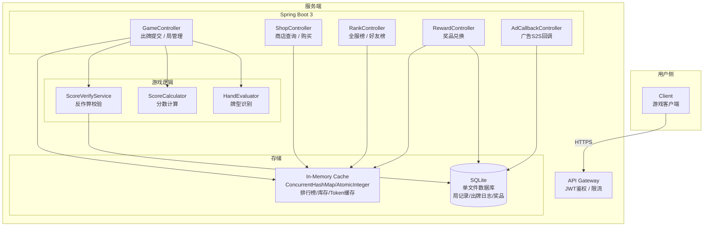
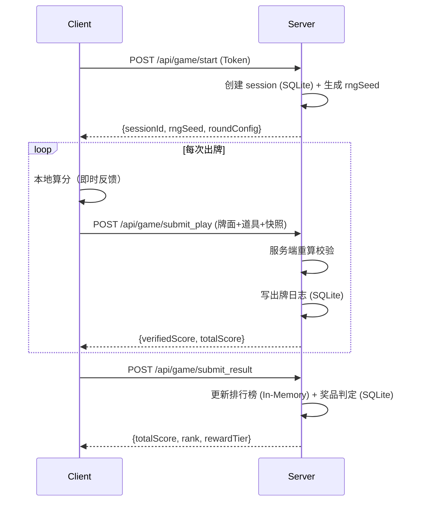
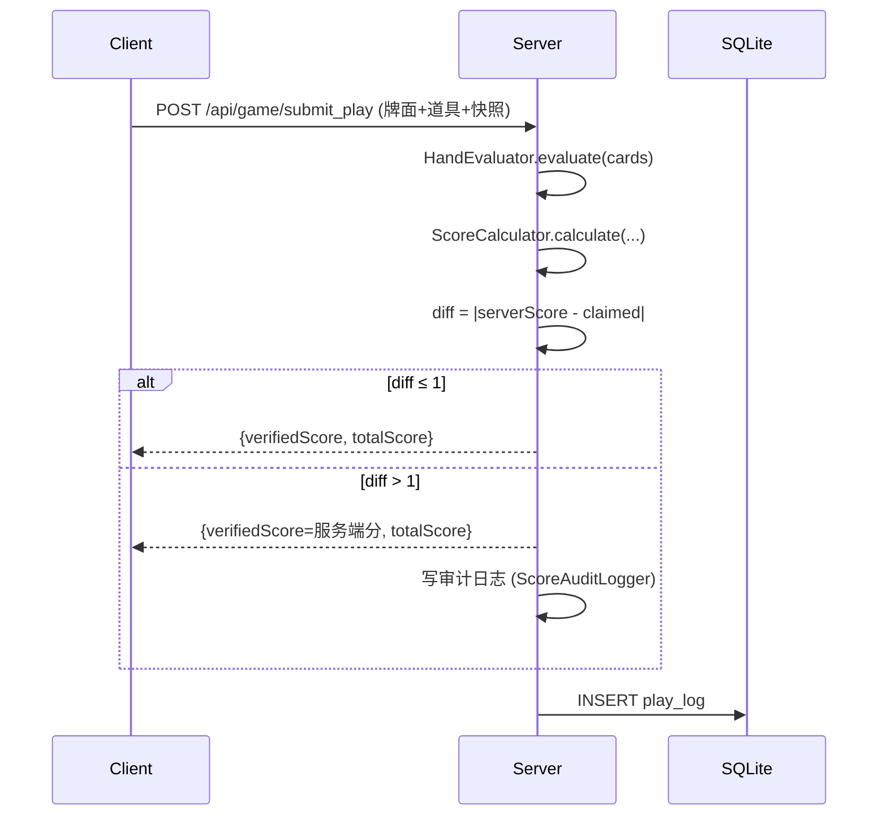
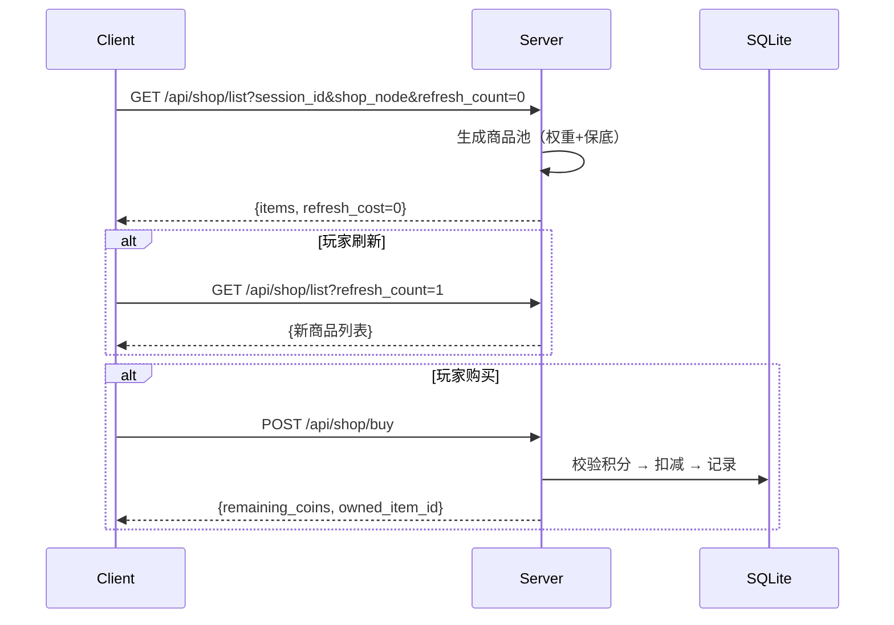
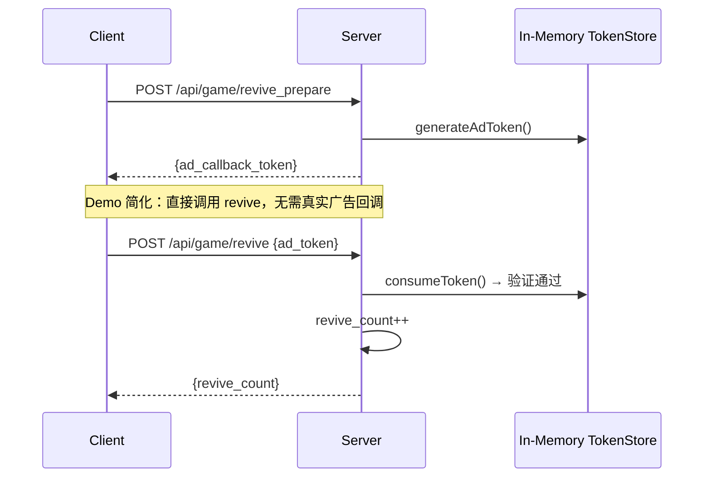
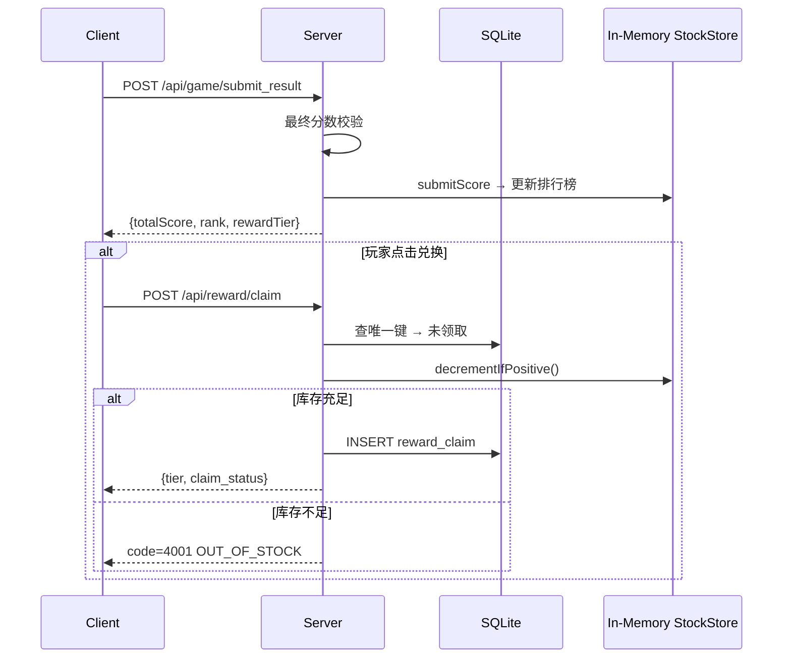
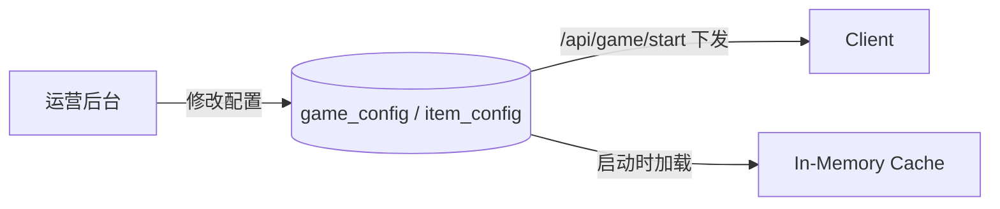
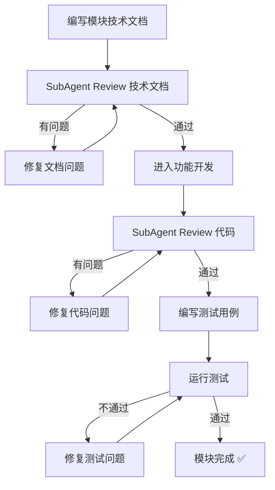

# 轻量级小丑牌 Roguelike 游戏——后端技术方案（Demo 版）

> 版本：v1.1 | 日期：2026-07-05 | 状态：Demo 阶段 | 定位：后端接口开发
>
> **变更说明**：v1.1 基于 v1.0 初稿，面向 Demo 阶段简化存储方案：MySQL → SQLite，Redis → 进程内内存缓存。移除前端章节，聚焦后端开发。新增第8章开发流程规范。

---

## 第0章 架构总览

### 0.1 系统架构图



### 0.2 技术选型总表

| 层 | 技术 | 版本 | 说明 |
|---|---|---|---|
| 游戏引擎 | Godot | 4.3+ | GL Compatibility 模式，Web Export（前端独立开发） |
| 前后端通信 | HTTP REST | - | JSON 请求/响应，前后端解耦 |
| 后端框架 | Spring Boot | 3.2.x | Java 17+ |
| ORM | MyBatis-Plus | 3.5.7 | 单表 CRUD 自动化 |
| 关系库 | **SQLite** | 3.x | 单文件嵌入式数据库，Demo 阶段零运维 |
| 缓存 | **In-Memory** | - | ConcurrentHashMap / AtomicInteger 替代 Redis |
| 鉴权 | JWT | jjwt 0.12 | 无状态 Token，客户端注入 |

> **Demo 简化说明**：生产环境应使用 MySQL + Redis，Demo 阶段用 SQLite + 内存缓存降低运维成本。切换时仅需改数据源配置和缓存实现，接口层无需变动。
>
> **SQLite 并发约束**：SQLite 单进程写入串行，WAL 模式下支持并发读。Demo 阶段为单机单进程部署，写串行可接受。`SQLiteConfig` 初始化时配置 `PRAGMA journal_mode=WAL; PRAGMA busy_timeout=5000;` 以启用 WAL 和 5s 写锁等待。适用并发用户约 ~50，超出此范围建议升级 MySQL。

### 0.3 数据流概览



---

## 第1章 前端（Godot）—— 本文档不涉及

> **说明**：本版本聚焦后端接口开发，前端（Godot 4 + GDScript）由独立团队负责。
>
> 前端相关设计参见 v1.0 版本文档。以下为前端与后端的关键**协议约定**，后端开发需据此实现接口：
>
> | 约定项 | 说明 |
> |--------|------|
> | 通信方式 | HTTP REST (JSON)，后续可升级 WebSocket |
> | 鉴权 | Bearer JWT Token，请求头 `Authorization` |
> | 牌数据序列化 | `{"r": 1, "s": 0}` → r=rank(1-13), s=suit(0-3) |
> | 道具 ID 对齐 | 前后端使用同一套 `item_id` 字符串（如 `joker_wealthy`） |
> | 分数快照 | 前端提交 `snapshot` 字段，后端独立校验 |
>
> 详细的接口协议见第2章。

---

## 第2章 前后端通信协议

### 2.1 HTTP 请求通用规范

| Header | 值 | 说明 |
|--------|---|------|
| `Authorization` | `Bearer {JWT}` | 鉴权 Token |
| `Content-Type` | `application/json` | 请求体格式 |
| `X-Request-Id` | UUID | 请求追踪，防重放 |
| `X-Client-Version` | `1.0.0` | 客户端版本号 |

### 2.2 接口定义

#### 2.2.1 POST /api/game/start

**请求**：
```json
{ "client_version": "1.0.0" }
```

**响应**：
```json
{
    "code": 0,
    "msg": "ok",
    "data": {
        "session_id": 10001,
        "rng_seed": 739251846293,
        "round_config": {
            "thresholds": [[300,800,1500],[1500,3000,5000],[3500,6000,10000]],
            "coin_rewards": [[30,50,80],[50,80,120],[80,120,180]],
            "max_revives": 3
        },
        "item_config": {
            "items": [
                {
                    "id": "joker_wealthy",
                    "display_name": "暴富小丑",
                    "description": "暴击率+10%，暴击倍率+0.5",
                    "price": 30,
                    "rarity": 0,
                    "item_type": 0,
                    "shop_weights": [30,25,20,15,10,5],
                    "upgrade_costs": [40,80],
                    "effect_class": "JokerWealthy",
                    "level_params": [
                        {"crit_rate_add":0.10,"crit_mult_add":0.5},
                        {"crit_rate_add":0.18,"crit_mult_add":1.0},
                        {"crit_rate_add":0.25,"crit_mult_add":1.5}
                    ]
                }
            ]
        },
        "reward_config": [
            {"min_score":0,"max_score":999,"reward_name":"参与奖","reward_type":"digital"},
            {"min_score":1000,"max_score":2999,"reward_name":"雪碧","reward_type":"drink"},
            {"min_score":3000,"max_score":5999,"reward_name":"奶茶","reward_type":"drink"},
            {"min_score":6000,"max_score":9999,"reward_name":"奶茶升级券","reward_type":"coupon"},
            {"min_score":10000,"max_score":-1,"reward_name":"稀有奖品","reward_type":"rare"}
        ]
    }
}
```

#### 2.2.2 POST /api/game/submit_play

**请求**：
```json
{
    "session_id": 10001,
    "round": 0,
    "blind": 1,
    "play_idx": 2,
    "cards": [{"r":1,"s":0},{"r":10,"s":1},{"r":11,"s":2},{"r":12,"s":3},{"r":13,"s":0}],
    "consumables": ["lucky_spark","double_potion"],
    "snapshot": {
        "hand_rank": 4,
        "base_score": 450,
        "mult": 2.0,
        "is_crit": true,
        "crit_mult": 2.5,
        "special_mult": 1.0
    },
    "claimed": 2250
}
```

**响应**：
```json
{
    "code": 0,
    "msg": "ok",
    "data": {
        "verified_score": 2250,
        "total_score": 4300,
        "is_crit": true
    }
}
```

#### 2.2.3 POST /api/game/submit_result

> 说明：每次出牌已通过 `submit_play` 实时上报并持久化到 `play_log` 表，`submit_result` 只需 `session_id` 即可，服务端从 DB 聚合计算最终分数。

**请求**：
```json
{
    "session_id": 10001
}
```

**响应**：
```json
{
    "code": 0,
    "msg": "ok",
    "data": {
        "total_score": 8500,
        "global_rank": 1234,
        "friend_rank": 5,
        "reward_tier": {"min_score":6000,"max_score":9999,"reward_name":"奶茶升级券","reward_type":"coupon"},
        "achievements": ["暴击大师"]
    }
}
```

#### 2.2.4 POST /api/game/revive

**请求**：
```json
{
    "session_id": 10001,
    "revive_type": 0,
    "ad_token": "ad_cb_abc123def456"
}
```

| 字段 | 类型 | 说明 |
|------|------|------|
| `revive_type` | int | 0=观看广告 1=拉好友 |
| `ad_token` | String | revive_type=0 时必填 |
| `friend_uid` | String | revive_type=1 时必填 |

#### 2.2.5 GET /api/shop/list

| 参数 | 类型 | 说明 |
|------|------|------|
| `session_id` | long | 当前局 ID |
| `shop_node` | int | 商店节点 0-5 |
| `refresh_count` | int | 当前已刷新次数 |

#### 2.2.6 POST /api/shop/buy

```json
{
    "session_id": 10001,
    "shop_node": 0,
    "item_id": "joker_wealthy",
    "slot_index": 0
}
```

#### 2.2.7 GET /api/rank/global

| 参数 | 类型 | 说明 |
|------|------|------|
| `page` | int | 页码，从 1 开始 |
| `size` | int | 每页条数，默认 20 |

#### 2.2.8 GET /api/rank/friends

同全服榜格式，增加 `is_self` 字段。

#### 2.2.9 POST /api/reward/claim

```json
{ "session_id": 10001 }
```

#### 2.2.10 GET /api/health

健康检查接口，无需鉴权。

**响应**：
```json
{
    "code": 0,
    "msg": "ok",
    "data": {
        "status": "UP",
        "db": "OK",
        "cache_entries": 42
    }
}
```

#### 2.2.11 POST /api/ad/callback（广告平台→服务端 S2S）

```json
{
    "callback_token": "ad_cb_abc123def456",
    "user_id": "u_001",
    "ad_type": "rewarded_video",
    "scene": "revive",
    "trans_id": "tx_789",
    "timestamp": 1782834000,
    "sign": "hmac_sha256_signature"
}
```

### 2.3 数据结构约定

| 概念 | Java 字段 | JSON 协议字段 | 说明 |
|------|-----------|--------------|------|
| 道具 ID | `ItemDTO.id` | `id` | 完全一致，如 `joker_wealthy` |
| 道具类型 | `ItemDTO.itemType` | `item_type` | 0=小丑牌 1=冲分道具 |
| 稀有度 | `ItemDTO.rarity` | `rarity` | 0=普通 1=稀有 |
| 商店权重 | `ItemDTO.shopWeights` | `shop_weights` | 6节点权重数组 |
| 效果类名 | `ItemDTO.effectClass` | `effect_class` | Java 反射加载 |
| 牌数据 | `CardDTO(rank, suit)` | `{"r":1,"s":0}` | r→rank(1-13)，s→suit(0-3) |
| 小丑牌状态 | `JokerStateDTO(id, level)` | `{id, level}` | 完全一致 |

### 2.4 错误码体系

| 错误码 | 常量名 | 说明 |
|--------|--------|------|
| 0 | SUCCESS | 成功 |
| 400 | PARAM_INVALID | 参数校验失败 |
| 401 | UNAUTHORIZED | Token 无效或过期 |
| 403 | FORBIDDEN | 无权限 |
| 1001 | SESSION_NOT_FOUND | 局记录不存在 |
| 1002 | SESSION_EXPIRED | 局已结束或超时 |
| 1003 | SESSION_USER_MISMATCH | 局不属于当前用户 |
| 1004 | REVIVE_LIMIT_EXCEEDED | 复活次数耗尽 |
| 1005 | AD_TOKEN_INVALID | 广告回调 token 无效 |
| 1006 | AD_TOKEN_EXPIRED | 广告 token 已过期（5分钟） |
| 1007 | AD_TOKEN_USED | 广告 token 已被消费 |
| 1008 | FRIEND_UID_INVALID | 好友 UID 无效 |
| 2001 | SCORE_CHEAT_DETECTED | 分数校验不通过 |
| 2002 | HAND_RANK_MISMATCH | 牌型不匹配 |
| 3001 | COINS_INSUFFICIENT | 游戏积分不足 |
| 3002 | ITEM_NOT_AVAILABLE | 道具不可购买 |
| 3003 | ITEM_ALREADY_OWNED | 小丑牌已拥有 |
| 4001 | REWARD_OUT_OF_STOCK | 奖品库存不足 |
| 4002 | REWARD_ALREADY_CLAIMED | 奖品已领取 |
| 4003 | REWARD_TIER_NOT_MATCHED | 分数未达任何奖品档位 |
| 5001 | CONFIG_LOAD_FAILED | 远程配置加载失败 |
| 9999 | INTERNAL_ERROR | 未知内部错误 |

---

## 第3章 后端详细设计

### 3.1 项目结构

```
poker-roguelike-server/
├── pom.xml
└── src/main/java/com/kuaishou/poker/
    ├── PokerApplication.java
    ├── controller/
    │   ├── GameController.java          # 局管理 / 出牌提交 / 结果提交
    │   ├── ShopController.java         # 商店查询 / 购买
    │   ├── RankController.java         # 全服榜 / 好友榜
    │   ├── RewardController.java       # 奖品兑换
    │   └── AdCallbackController.java   # 广告 S2S 回调
    ├── service/
    │   ├── GameService.java           # 局生命周期管理
    │   ├── ScoreVerifyService.java     # 分数校验（反作弊）
    │   ├── ShopService.java           # 商店逻辑
    │   ├── RankService.java           # 排行榜逻辑
    │   ├── RewardService.java         # 奖品逻辑
    │   └── AdCallbackService.java      # 广告回调逻辑
    ├── domain/
    │   ├── entity/                    # 数据库实体
    │   │   ├── GameSession.java
    │   │   ├── PlayLog.java
    │   │   ├── RewardTier.java
    │   │   ├── RewardClaim.java
    │   │   ├── AdCallbackLog.java
    │   │   └── GameConfig.java
    │   ├── dto/                        # 请求/响应 DTO
    │   │   ├── SubmitPlayRequest.java
    │   │   ├── StartGameResponse.java
    │   │   ├── ApiResult.java
    │   │   └── ItemDTO.java
    │   └── enums/                      # 枚举常量
    │       ├── HandRank.java
    │       ├── SessionStatus.java
    │       └── ReviveType.java
    ├── game/                           # 纯游戏逻辑（无外部依赖）
    │   ├── HandEvaluator.java          # 牌型识别
    │   ├── ScoreCalculator.java        # 分数计算
    │   ├── model/
    │   │   ├── Card.java
    │   │   ├── HandResult.java
    │   │   ├── ScoreResult.java
    │   │   ├── PlaySnapshot.java
    │   │   └── ItemModifier.java
    │   └── registry/
    │       └── ItemModifierRegistry.java
    ├── mapper/                         # MyBatis-Plus Mapper
    │   ├── GameSessionMapper.java
    │   ├── PlayLogMapper.java
    │   └── AdCallbackLogMapper.java
    ├── infrastructure/                # 基础设施层
    │   ├── cache/                      # 内存缓存（Demo 替代 Redis）
    │   │   ├── InMemoryLeaderboard.java
    │   │   ├── InMemoryTokenStore.java
    │   │   └── InMemoryStockStore.java
    │   └── anti_cheat/
    │       └── ScoreAuditLogger.java
    └── config/
        ├── SQLiteConfig.java          # SQLite 数据源配置（WAL + busy_timeout）
        ├── SecurityConfig.java        # JWT 安全配置
        └── GlobalExceptionHandler.java
```

> **分层说明**：
> - `controller` — 接口层，只做参数校验和调用 Service
> - `service` — 业务层，编排逻辑，不直接操作 DB
> - `mapper` — 数据访问层，MyBatis-Plus 自动化单表 CRUD
> - `game` — 纯游戏逻辑层，零外部依赖，方便单元测试
> - `infrastructure/cache` — 缓存层，接口抽象，Demo 用内存实现，生产可切换 Redis

### 3.2 牌型识别（Java，与 GDScript 算法一致）

```java
// game/HandEvaluator.java
public class HandEvaluator {

    public enum HandRank {
        HIGH_CARD(0, 50),
        ONE_PAIR(1, 100),
        TWO_PAIR(2, 180),
        THREE_OF_KIND(3, 300),
        STRAIGHT(4, 450),
        FLUSH(5, 600),
        FULL_HOUSE(6, 900),
        FOUR_OF_KIND(7, 1500),
        STRAIGHT_FLUSH(8, 2500);

        public final int code;
        public final int baseScore;
        HandRank(int code, int baseScore) { this.code = code; this.baseScore = baseScore; }
    }

    public static HandResult evaluate(List<Card> cards) {
        if (cards.size() != 5) throw new IllegalArgumentException("必须选 5 张牌");

        int[] ranks = cards.stream().mapToInt(Card::getRank).sorted().toArray();
        int[] suits = cards.stream().mapToInt(Card::getSuit).toArray();
        boolean flush = isFlush(suits);
        boolean straight = isStraight(ranks);
        int[] counts = countRanks(ranks);

        HandRank rank;
        if      (flush && straight)                                        rank = HandRank.STRAIGHT_FLUSH;
        else if (hasCount(counts, 4))                                      rank = HandRank.FOUR_OF_KIND;
        else if (hasCount(counts, 3) && hasCount(counts, 2))              rank = HandRank.FULL_HOUSE;
        else if (flush)                                                   rank = HandRank.FLUSH;
        else if (straight)                                                rank = HandRank.STRAIGHT;
        else if (hasCount(counts, 3))                                     rank = HandRank.THREE_OF_KIND;
        else if (countOf(counts, 2) == 2)                                 rank = HandRank.TWO_PAIR;
        else if (countOf(counts, 2) == 1)                                 rank = HandRank.ONE_PAIR;
        else                                                              rank = HandRank.HIGH_CARD;

        return HandResult.builder().handRank(rank).baseScore(rank.baseScore).build();
    }

    private static boolean isFlush(int[] suits) {
        return Arrays.stream(suits).allMatch(s -> s == suits[0]);
    }

    private static boolean isStraight(int[] sorted) {
        if (Arrays.equals(sorted, new int[]{1, 2, 3, 4, 5})) return true;
        if (Arrays.equals(sorted, new int[]{1, 10, 11, 12, 13})) return true;
        for (int i = 1; i < sorted.length; i++) {
            if (sorted[i] - sorted[i - 1] != 1) return false;
        }
        return true;
    }

    private static int[] countRanks(int[] ranks) {
        Map<Integer, Long> map = Arrays.stream(ranks).boxed()
                .collect(Collectors.groupingBy(r -> r, Collectors.counting()));
        return map.values().stream().mapToInt(Long::intValue).sorted().toArray();
    }

    private static boolean hasCount(int[] counts, int target) {
        return Arrays.stream(counts).anyMatch(c -> c == target);
    }

    private static long countOf(int[] counts, int target) {
        return Arrays.stream(counts).filter(c -> c == target).count();
    }
}
```

### 3.3 分数计算与校验

```java
// game/ScoreCalculator.java  (纯逻辑，零外部依赖)
public class ScoreCalculator {

    /**
     * 计算出牌分数
     * @param handResult  牌型识别结果
     * @param jokers      当前拥有的小丑牌列表
     * @param consumables 本次使用的冲分道具ID列表
     * @param rngSeed     本次出牌的RNG子种子
     */
    public static ScoreResult calculate(
            HandResult handResult,
            List<JokerState> jokers,
            List<String> consumables,
            long rngSeed) {

        Random rng = new Random(rngSeed);

        // 1. 基础分 = 牌型基础分 × 牌型倍率
        double mult = 1.0;
        int baseScore = handResult.getBaseScore();

        // 2. 小丑牌修饰
        for (JokerState joker : jokers) {
            ItemModifier mod = ItemModifierRegistry.getModifier(joker.getId());
            if (mod != null) {
                mult = mod.applyMult(mult, joker.getLevel(), rng);
                baseScore = mod.applyScoreAdd(baseScore, joker.getLevel());
            }
        }

        // 3. 冲分道具修饰
        for (String consumableId : consumables) {
            ItemModifier mod = ItemModifierRegistry.getModifier(consumableId);
            if (mod != null) {
                mult = mod.applyMult(mult, 0, rng);
            }
        }

        // 4. 暴击判定（基于 RNG）
        double critRate = 0.05;  // 基础5%
        double critMult = 1.5;   // 基础1.5倍
        for (JokerState joker : jokers) {
            ItemModifier mod = ItemModifierRegistry.getModifier(joker.getId());
            if (mod != null) {
                critRate += mod.getCritRateAdd(joker.getLevel());
                critMult += mod.getCritMultAdd(joker.getLevel());
            }
        }
        boolean isCrit = rng.nextDouble() < critRate;
        if (isCrit) {
            mult *= critMult;
        }

        // 5. 最终分数 = 基础分 × 总倍率，取整
        int score = (int) Math.round(baseScore * mult);

        return ScoreResult.builder()
                .score(score)
                .isCrit(isCrit)
                .mult(mult)
                .build();
    }
}
```

```java
// service/ScoreVerifyService.java
@Service
@Slf4j
@RequiredArgsConstructor
public class ScoreVerifyService {

    private final GameSessionMapper sessionMapper;
    private final ScoreAuditLogger auditLogger;
    private static final int TOLERANCE = 1;

    public VerifyResult verify(SubmitPlayRequest req) {
        GameSession session = sessionMapper.selectById(req.getSessionId());
        if (session == null || !session.getUserId().equals(req.getUserId())) {
            throw new BizException(ErrorCode.SESSION_NOT_FOUND);
        }

        // 1. 服务端独立计算牌型
        HandResult handResult = HandEvaluator.evaluate(req.getCards());
        if (handResult.getHandRank().code != req.getSnapshot().getHandRank()) {
            auditLogger.logCheat(req, "hand_rank_mismatch",
                    handResult.getHandRank().code, req.getSnapshot().getHandRank());
            throw new BizException(ErrorCode.HAND_RANK_MISMATCH);
        }

        // 2. 重建小丑牌状态
        List<JokerState> jokers = buildJokerStates(session.getJokerStatesJson());

        // 3. 计算 RNG 种子
        long rngSeed = computeRngSeed(
            session.getRngSeed(), req.getRound(), req.getBlind(), req.getPlayIdx()
        );

        // 4. 服务端重算分数
        ScoreResult serverResult = ScoreCalculator.calculate(
            handResult, jokers, req.getConsumables(), rngSeed
        );

        // 5. 比对
        int diff = Math.abs(serverResult.getScore() - req.getClaimed());
        if (diff > TOLERANCE) {
            auditLogger.logCheat(req, "score_mismatch",
                    serverResult.getScore(), req.getClaimed());
            log.warn("Score mismatch uid={} claimed={} server={} diff={}",
                    req.getUserId(), req.getClaimed(), serverResult.getScore(), diff);
        }

        return VerifyResult.builder()
                .verifiedScore(serverResult.getScore())
                .isCrit(serverResult.isCrit())
                .diff(diff)
                .build();
    }

    // 每次出牌用不同子种子，防客户端预测暴击
    private long computeRngSeed(long baseSeed, int round, int blind, int playIdx) {
        return baseSeed ^ ((long) round << 16 | (long) blind << 8 | (long) playIdx);
    }
}
```

### 3.4 广告回调服务（Demo 简化版）

> **Demo 简化**：不接入真实广告 SDK，广告 Token 用内存 ConcurrentHashMap 存储。前端调用 `revive` 接口时直接通过，无需真实广告回调。

```java
// infrastructure/cache/InMemoryTokenStore.java
@Component
public class InMemoryTokenStore {

    private static final long TOKEN_TTL_SECONDS = 300;  // 5分钟
    private final ConcurrentHashMap<String, TokenEntry> tokenStore = new ConcurrentHashMap<>();

    /** 预生成广告回调 Token */
    public String generateAdToken(String userId, Long sessionId) {
        String token = "ad_cb_" + UUID.randomUUID().toString().replace("-", "");
        tokenStore.put(token, new TokenEntry(userId, sessionId,
                System.currentTimeMillis() + TOKEN_TTL_SECONDS * 1000));
        return token;
    }

    /** 验证并消费 Token（防重放） */
    public TokenEntry consumeToken(String callbackToken) {
        TokenEntry entry = tokenStore.remove(callbackToken);
        if (entry == null) return null;
        if (System.currentTimeMillis() > entry.expireAt) return null;
        return entry;
    }

    /** 复活时校验 Token 是否已被消费 */
    public boolean isAdTokenConsumed(String callbackToken) {
        return !tokenStore.containsKey(callbackToken);
    }

    /** 定时清理过期 Token */
    @Scheduled(fixedRate = 60_000)
    public void cleanupExpired() {
        long now = System.currentTimeMillis();
        tokenStore.entrySet().removeIf(e -> e.getValue().expireAt < now);
    }

    public record TokenEntry(String userId, Long sessionId, long expireAt) {}
}
```

### 3.5 商店服务

```java
// service/ShopService.java
@Service
@RequiredArgsConstructor
public class ShopService {

    private final GameSessionMapper sessionMapper;
    private final ItemModifierRegistry itemRegistry;

    // Demo: 商店状态用内存缓存替代 Redis
    private final ConcurrentHashMap<String, CachedShop> shopCache = new ConcurrentHashMap<>();
    private static final int SHOP_SLOTS = 5;
    private static final long SHOP_CACHE_TTL_MS = 30 * 60_000;  // 30分钟

    public ShopListResponse list(Long sessionId, int shopNode, int refreshCount) {
        String key = sessionId + ":" + shopNode;
        CachedShop cached = shopCache.get(key);

        List<ItemDTO> items;
        if (cached != null && !cached.isExpired() && refreshCount == 0) {
            items = cached.items;
        } else {
            items = generateShopItems(shopNode);
            shopCache.put(key, new CachedShop(items, System.currentTimeMillis() + SHOP_CACHE_TTL_MS));
        }

        return ShopListResponse.builder()
                .items(items)
                .refreshCost(calculateRefreshCost(refreshCount))
                .hasFreeRefresh(refreshCount == 0)
                .build();
    }

    @Transactional
    public BuyItemResponse buy(String userId, Long sessionId, int shopNode, String itemId) {
        GameSession session = sessionMapper.selectById(sessionId);
        ItemDTO itemConfig = itemRegistry.getConfig(itemId);

        if (itemConfig.getItemType() == 0 && isJokerOwned(session, itemId)) {
            throw new BizException(ErrorCode.ITEM_ALREADY_OWNED);
        }

        if (session.getGameCoins() < itemConfig.getPrice()) {
            throw new BizException(ErrorCode.COINS_INSUFFICIENT);
        }
        sessionMapper.deductCoins(sessionId, itemConfig.getPrice());

        if (itemConfig.getItemType() == 0) {
            sessionMapper.addJoker(sessionId, itemId);
        }

        return BuyItemResponse.builder()
                .remainingCoins(session.getGameCoins() - itemConfig.getPrice())
                .ownedItemId(itemId)
                .build();
    }

    // ... generateShopItems / weightedPick / calculateRefreshCost 同 v1.0

    /** 定时清理过期商店缓存 */
    @Scheduled(fixedRate = 5 * 60_000)  // 每5分钟
    public void cleanupExpiredShopCache() {
        long now = System.currentTimeMillis();
        shopCache.entrySet().removeIf(e -> e.getValue().expireAt < now);
    }

    private record CachedShop(List<ItemDTO> items, long expireAt) {
        boolean isExpired() { return System.currentTimeMillis() > expireAt; }
    }
}
```

### 3.6 排行榜服务（内存版，启动时从 SQLite 重建）

> **设计要点**：排行榜是 `game_session` 表的**派生数据**（每个用户的最高分），SQLite 是 source of truth，内存是加速缓存。服务重启时从 DB 重建，数据不丢失。

```java
// infrastructure/cache/InMemoryLeaderboard.java
@Component
@RequiredArgsConstructor
public class InMemoryLeaderboard {

    private final GameSessionMapper sessionMapper;

    // ConcurrentHashMap 替代 Redis ZSet，Demo 阶段足够
    private final ConcurrentHashMap<String, Long> scoreMap = new ConcurrentHashMap<>();

    /** 启动时从 SQLite 重建排行榜（防重启丢失） */
    @PostConstruct
    public void init() {
        // 取每个用户已完成的局的最高分
        List<GameSession> topSessions = sessionMapper.selectList(
            new QueryWrapper<GameSession>()
                .select("user_id", "MAX(total_score) as total_score")
                .eq("status", 1)  // 只看已完成的局
                .groupBy("user_id")
        );
        topSessions.forEach(s -> scoreMap.put(s.getUserId(), s.getTotalScore()));
    }

    /** 提交分数，只保留最高分 */
    public void submitScore(String userId, long score) {
        scoreMap.merge(userId, score, Math::max);
    }

    /** 全服排行榜（分页） */
    public List<RankEntry> getGlobalTop(int page, int size) {
        int start = (page - 1) * size;
        List<Map.Entry<String, Long>> sorted = scoreMap.entrySet().stream()
                .sorted(Map.Entry.<String, Long>comparingByValue().reversed())
                .skip(start)
                .limit(size)
                .collect(Collectors.toList());
        return IntStream.range(0, sorted.size())
                .mapToObj(i -> RankEntry.builder()
                        .userId(sorted.get(i).getKey())
                        .score(sorted.get(i).getValue())
                        .rank(start + i + 1)
                        .build())
                .collect(Collectors.toList());
    }

    /** 获取个人排名 */
    public long getMyGlobalRank(String userId) {
        Long myScore = scoreMap.get(userId);
        if (myScore == null) return -1L;
        return scoreMap.values().stream()
                .filter(s -> s > myScore)
                .count() + 1;
    }

    /** 好友榜（Demo 简化：无好友体系，返回全服前 N） */
    public List<RankEntry> getFriendsRank(String userId, int size) {
        return getGlobalTop(1, size);
    }
}
```

### 3.7 奖品服务

```java
// service/RewardService.java
@Service
@Slf4j
@RequiredArgsConstructor
public class RewardService {

    private final GameSessionMapper sessionMapper;
    private final RewardTierMapper tierMapper;
    private final RewardClaimMapper claimMapper;
    // Demo: 用 AtomicInteger 替代 Redis 库存扣减
    private final InMemoryStockStore stockStore;

    public RewardTier matchTier(long score) {
        return tierMapper.selectByScore(score);
    }

    @Transactional
    public ClaimResult claim(String userId, Long sessionId) {
        // 1. 防重复
        RewardClaim existing = claimMapper.selectByUserAndSession(userId, sessionId);
        if (existing != null) return ClaimResult.alreadyClaimed(existing);

        GameSession session = sessionMapper.selectById(sessionId);
        RewardTier tier = matchTier(session.getTotalScore());
        if (tier == null) return ClaimResult.noReward();

        // 2. 内存原子库存扣减
        if (tier.getStockLimit() != -1) {
            if (!stockStore.decrementIfPositive(tier.getId())) {
                return ClaimResult.outOfStock();
            }
        }

        // 3. 写领取记录（唯一键防并发重复）
        RewardClaim claim = RewardClaim.builder()
                .userId(userId).sessionId(sessionId).tierId(tier.getId())
                .status(ClaimStatus.PENDING.getCode()).build();
        try {
            claimMapper.insert(claim);
        } catch (DuplicateKeyException e) {
            if (tier.getStockLimit() != -1)
                stockStore.increment(tier.getId());
            return ClaimResult.alreadyClaimed(null);
        }

        tierMapper.incrementStockUsed(tier.getId());
        return ClaimResult.success(tier);
    }
}

// infrastructure/cache/InMemoryStockStore.java
@Component
@RequiredArgsConstructor
public class InMemoryStockStore {

    private final RewardTierMapper tierMapper;
    private final ConcurrentHashMap<Integer, AtomicInteger> stockMap = new ConcurrentHashMap<>();

    /** 启动时从 SQLite 重建库存（防重启丢失） */
    @PostConstruct
    public void init() {
        tierMapper.selectList(new QueryWrapper<RewardTier>().eq("is_active", 1))
            .forEach(t -> {
                if (t.getStockLimit() != -1) {
                    // 剩余库存 = 限制总量 - 已使用量
                    stockMap.put(t.getId(),
                        new AtomicInteger(t.getStockLimit() - t.getStockUsed()));
                }
            });
    }

    public boolean decrementIfPositive(int tierId) {
        return stockMap.computeIfAbsent(tierId, k -> new AtomicInteger(-1))
                .decrementAndGet() >= 0;
    }

    public void increment(int tierId) {
        AtomicInteger stock = stockMap.get(tierId);
        if (stock != null) stock.incrementAndGet();
    }

    public void initStock(int tierId, int limit) {
        stockMap.put(tierId, new AtomicInteger(limit));
    }
}
```

---

## 第4章 数据库设计

### 4.1 完整 Schema（SQLite 适配版）

> **SQLite 适配说明**：
> - `BIGINT` → `INTEGER`（SQLite 统一整数类型）
> - `TINYINT` → `INTEGER`（同上）
> - `JSON` → `TEXT`（SQLite 无原生 JSON 类型，存 JSON 字符串，MyBatis-Plus 自动序列化）
> - `DATETIME` → `TEXT`（SQLite 存 ISO-8601 字符串）
> - `ENGINE=InnoDB` → 移除（SQLite 无存储引擎概念）
> - `INDEX` → `CREATE INDEX` 独立语句（SQLite 不支持内联索引）
> - `ON UPDATE CURRENT_TIMESTAMP` → 移除（应用层负责更新时间戳）

```sql
-- ============================================
-- poker_roguelike.db  (SQLite 3.x)
-- 启动时自动创建于项目根目录
-- 使用 IF NOT EXISTS / OR IGNORE 防重复初始化
-- ============================================

-- 游戏局记录
CREATE TABLE IF NOT EXISTS game_session (
    id               INTEGER PRIMARY KEY AUTOINCREMENT,
    user_id          TEXT    NOT NULL,
    start_time       TEXT    NOT NULL,
    end_time         TEXT,
    total_score      INTEGER NOT NULL DEFAULT 0,
    status           INTEGER NOT NULL DEFAULT 0,  -- 0进行中 1完成 2放弃
    rng_seed         INTEGER NOT NULL,
    revive_count     INTEGER NOT NULL DEFAULT 0,
    game_coins       INTEGER NOT NULL DEFAULT 0,
    joker_states     TEXT,                          -- JSON字符串
    owned_consumables TEXT,                         -- JSON字符串
    created_at       TEXT    NOT NULL DEFAULT (datetime('now')),
    updated_at       TEXT    NOT NULL DEFAULT (datetime('now'))
);
CREATE INDEX idx_session_user_id ON game_session(user_id);
CREATE INDEX idx_session_score   ON game_session(total_score DESC);
CREATE INDEX idx_session_created ON game_session(created_at);

-- 出牌明细日志
CREATE TABLE IF NOT EXISTS play_log (
    id           INTEGER PRIMARY KEY AUTOINCREMENT,
    session_id   INTEGER NOT NULL,
    round_idx    INTEGER NOT NULL,  -- 轮次 0-2
    blind_idx    INTEGER NOT NULL,  -- 回合 0=小盲 1=大盲 2=Boss
    play_idx     INTEGER NOT NULL,  -- 第几次出牌 0-3
    cards_json   TEXT    NOT NULL,  -- 5张牌 JSON
    consumables  TEXT,              -- 使用的冲分道具ID列表 JSON
    score        INTEGER NOT NULL,
    is_crit      INTEGER NOT NULL DEFAULT 0,  -- 0=否 1=是
    snapshot     TEXT    NOT NULL,  -- 客户端快照 JSON
    server_score INTEGER,           -- 服务端重算分数
    diff         INTEGER,           -- 客户端与服务端差值
    created_at   TEXT    NOT NULL DEFAULT (datetime('now'))
);
CREATE INDEX idx_play_log_session ON play_log(session_id);

-- 广告回调日志
CREATE TABLE IF NOT EXISTS ad_callback_log (
    id              INTEGER PRIMARY KEY AUTOINCREMENT,
    trans_id        TEXT NOT NULL UNIQUE,  -- 幂等：同一交易只处理一次
    callback_token  TEXT NOT NULL,
    user_id         TEXT NOT NULL,
    session_id      INTEGER NOT NULL,
    ad_type         TEXT NOT NULL,
    scene           TEXT NOT NULL,
    created_at      TEXT NOT NULL DEFAULT (datetime('now'))
);
CREATE INDEX idx_ad_token ON ad_callback_log(callback_token);
CREATE INDEX idx_ad_user_session ON ad_callback_log(user_id, session_id);

-- 奖品档位配置
CREATE TABLE IF NOT EXISTS reward_tier (
    id           INTEGER PRIMARY KEY AUTOINCREMENT,
    min_score    INTEGER NOT NULL,
    max_score    INTEGER NOT NULL,  -- -1表示无上限
    reward_name  TEXT    NOT NULL,
    reward_type  TEXT    NOT NULL,  -- drink/coupon/digital/rare
    stock_limit  INTEGER NOT NULL DEFAULT -1,  -- -1不限库存
    stock_used   INTEGER NOT NULL DEFAULT 0,
    is_active    INTEGER NOT NULL DEFAULT 1
);
CREATE INDEX idx_reward_score_range ON reward_tier(min_score, max_score);

-- 奖品领取记录
CREATE TABLE IF NOT EXISTS reward_claim (
    id           INTEGER PRIMARY KEY AUTOINCREMENT,
    user_id      TEXT    NOT NULL,
    session_id   INTEGER NOT NULL,
    tier_id      INTEGER NOT NULL,
    status       INTEGER NOT NULL DEFAULT 0,  -- 0待发放 1已发放 2失败
    fail_reason  TEXT,
    created_at   TEXT    NOT NULL DEFAULT (datetime('now')),
    updated_at   TEXT    NOT NULL DEFAULT (datetime('now')),
    UNIQUE(user_id, session_id)  -- 同一局只能领一次
);

-- 游戏配置（热更新）
CREATE TABLE IF NOT EXISTS game_config (
    id           INTEGER PRIMARY KEY AUTOINCREMENT,
    config_key   TEXT NOT NULL UNIQUE,
    config_value TEXT NOT NULL,  -- JSON字符串
    version      INTEGER NOT NULL DEFAULT 0,
    updated_at   TEXT NOT NULL DEFAULT (datetime('now'))
);

-- 道具配置（热更新）
CREATE TABLE IF NOT EXISTS item_config (
    id           INTEGER PRIMARY KEY AUTOINCREMENT,
    item_id      TEXT NOT NULL UNIQUE,
    config_data  TEXT NOT NULL,  -- JSON字符串
    version      INTEGER NOT NULL DEFAULT 0,
    updated_at   TEXT NOT NULL DEFAULT (datetime('now'))
);
```

### 4.2 初始配置数据

```sql
-- 门槛与积分配置
INSERT OR IGNORE INTO game_config (config_key, config_value) VALUES
('round_thresholds', '[[300,800,1500],[1500,3000,5000],[3500,6000,10000]]'),
('coin_rewards', '[[30,50,80],[50,80,120],[80,120,180]]'),
('max_revives', '3'),
('score_tolerance', '1'),
('shop_slot_count', '5'),
('refresh_cost_formula', '{"base":5,"increment":5}');

-- 奖品档位
INSERT OR IGNORE INTO reward_tier (min_score, max_score, reward_name, reward_type, stock_limit) VALUES
(0,     999,   '参与奖',     'digital', -1),
(1000,  2999,  '雪碧',       'drink',   5000),
(3000,  5999,  '奶茶',       'drink',   3000),
(6000,  9999,  '奶茶升级券', 'coupon',  1000),
(10000, -1,    '稀有奖品',   'rare',    100);

-- 道具配置示例
INSERT OR IGNORE INTO item_config (item_id, config_data) VALUES
('joker_wealthy', '{
    "display_name":"暴富小丑","description":"暴击率+10%，暴击倍率+0.5",
    "price":30,"rarity":0,"item_type":0,
    "shop_weights":[30,25,20,15,10,5],
    "upgrade_costs":[40,80],
    "effect_class":"JokerWealthy",
    "level_params":[
        {"crit_rate_add":0.10,"crit_mult_add":0.5},
        {"crit_rate_add":0.18,"crit_mult_add":1.0},
        {"crit_rate_add":0.25,"crit_mult_add":1.5}
    ]
}'),
('joker_chain', '{
    "display_name":"连锁小丑","description":"连续同牌型倍率提升",
    "price":40,"rarity":0,"item_type":0,
    "shop_weights":[25,25,25,20,15,10],
    "upgrade_costs":[50,100],
    "effect_class":"JokerChain",
    "level_params":[
        {"chain_mult":0.15},
        {"chain_mult":0.25},
        {"chain_mult":0.40}
    ]
}'),
('joker_boom', '{
    "display_name":"爆炸小丑","description":"低概率战斗分额外×10",
    "price":50,"rarity":0,"item_type":0,
    "shop_weights":[15,12,15,18,15,10],
    "upgrade_costs":[60,120],
    "effect_class":"JokerBoom",
    "level_params":[
        {"boom_prob":0.03,"boom_mult":10.0},
        {"boom_prob":0.05,"boom_mult":15.0},
        {"boom_prob":0.08,"boom_mult":20.0}
    ]
}');
```

---

## 第5章 关键业务流程

### 5.1 出牌流程



### 5.2 商店购买流程



### 5.3 复活流程（Demo 简化）



### 5.4 奖品兑换流程



---

## 第6章 配置与热更新

### 6.1 热更新架构（Demo 简化）

所有数值配置存放在 `game_config` 和 `item_config` SQLite 表中，随 `/api/game/start` 一起下发客户端。



### 6.2 配置加载流程（Server 端）

```java
// service/ConfigService.java (简化版)
@Service
@RequiredArgsConstructor
public class ConfigService {

    private final GameConfigMapper configMapper;
    private final ItemConfigMapper itemConfigMapper;

    // 启动时加载到内存，减少 SQLite 查询频率
    private final ConcurrentHashMap<String, String> configCache = new ConcurrentHashMap<>();
    private List<ItemDTO> cachedItems = List.of();

    @PostConstruct
    public void init() {
        reload();
    }

    public void reload() {
        configMapper.selectList(null).forEach(
            c -> configCache.put(c.getConfigKey(), c.getConfigValue())
        );
        cachedItems = itemConfigMapper.selectList(null).stream()
            .map(this::toItemDTO)
            .collect(Collectors.toList());
    }

    public String getConfig(String key) {
        return configCache.get(key);
    }

    public List<ItemDTO> getAllItems() {
        return cachedItems;
    }
}
```

### 6.3 配置更新规范

| 配置项 | 表 | 热更新 | 说明 |
|--------|---|--------|------|
| 门槛数值 | game_config | ✅ | 改 DB 即生效，下次 /start 下发 |
| 游戏积分奖励 | game_config | ✅ | 同上 |
| 道具价格/权重 | item_config | ✅ | 同上 |
| 道具效果数值 | item_config | ✅ | 同上 |
| 奖品档位 | reward_tier | ✅ | 直接改 DB |
| 最大复活次数 | game_config | ✅ | 同上 |
| 错误码 | 代码 | ❌ | 需发版 |

---

## 第7章 部署与运维

### 7.1 Demo 部署（单 Jar + SQLite 文件）

```bash
# 1. 构建
mvn clean package -DskipTests

# 2. 运行（SQLite 数据库文件自动创建）
java -jar target/poker-roguelike-server-1.0.jar

# 3. 验证
curl http://localhost:8080/api/health
```

**产物结构**：
```
poker-roguelike-server-1.0.jar   # 可执行 jar（内嵌 Tomcat）
poker_roguelike.db               # SQLite 数据库文件（首次运行自动创建）
```

### 7.2 关键配置项

| 配置 | 默认值 | 说明 |
|------|--------|------|
| `server.port` | 8080 | 服务端口 |
| `spring.datasource.url` | `jdbc:sqlite:poker_roguelike.db` | SQLite 文件路径 |
| `jwt.secret` | - | JWT 签名密钥 |
| `jwt.expiration` | 86400000 | Token 有效期（毫秒） |

### 7.3 SQLite 配置（WAL + busy_timeout）

```java
// config/SQLiteConfig.java
@Configuration
public class SQLiteConfig {

    @Bean
    public DataSource dataSource(@Value("${spring.datasource.url}") String url) {
        SQLiteDataSource ds = new SQLiteDataSource();
        ds.setUrl(url);
        return ds;
    }

    @Bean
    public CommandLineRunner initSQLite(JdbcTemplate jdbc) {
        return args -> {
            jdbc.execute("PRAGMA journal_mode=WAL");       // 启用 WAL 模式（并发读）
            jdbc.execute("PRAGMA busy_timeout=5000");       // 写锁等待 5s
            jdbc.execute("PRAGMA synchronous=NORMAL");      // 平衡性能与安全
            log.info("SQLite initialized: WAL mode, busy_timeout=5000ms");
        };
    }
}
```

### 7.4 SQLite 数据初始化

首次启动时，应用自动执行 `schema.sql`（建表）和 `data.sql`（初始数据）。

```yaml
# application.yml
spring:
  sql:
    init:
      mode: always           # 首次启动时执行
      schema-locations: classpath:schema.sql
      data-locations: classpath:data.sql
```

### 7.5 后续升级路径

| 组件 | Demo | 生产 | 升级改动 |
|------|------|------|----------|
| 关系库 | SQLite 文件 | MySQL 8.0 | 改 datasource 配置 + 调整 SQL 类型 |
| 缓存 | ConcurrentHashMap | Redis 7 | 实现 Cache 接口的 Redis 版本 |
| 部署 | 单 Jar | Docker Compose | 加 docker-compose.yml |
| 前端 | 前端独立开发 | Godot Web Export | Nginx 静态资源 + COOP/COEP |

---

## 第8章 开发流程规范

> 本章定义后端开发的标准流程，确保每个模块从设计到交付都有质量保障。

### 8.1 总体开发流程



### 8.2 开发流程详解

#### 阶段 1：技术文档编写

每个模块在开发前**必须**先编写技术文档，文档内容包括：

| 要素 | 说明 |
|------|------|
| 模块目标 | 该模块要解决什么问题 |
| 接口设计 | API 路径、请求/响应格式 |
| 数据模型 | 涉及的实体、DTO、枚举 |
| 核心逻辑 | 关键算法、业务规则 |
| 依赖关系 | 依赖哪些其他模块/服务 |
| 异常处理 | 错误码、异常场景 |
| 测试策略 | 关键测试场景 |

文档存放在 `server/docs/modules/` 目录下，命名规范：`{模块名}_design.md`

示例：`server/docs/modules/game_service_design.md`

#### 阶段 2：技术文档 Review

使用 SubAgent 对技术文档进行 Review，关注点：

- [ ] 接口设计是否符合 REST 规范
- [ ] 数据模型是否与 Schema 对齐
- [ ] 业务逻辑是否有遗漏边界场景
- [ ] 错误处理是否完整
- [ ] 是否考虑并发安全
- [ ] 与其他模块的依赖是否清晰

**Review 不通过** → 修复文档 → 重新 Review
**Review 通过** → 进入阶段 3

#### 阶段 3：功能开发

根据通过 Review 的技术文档进行编码，遵循分层架构：

```
Controller → Service → Mapper / Infrastructure
   ↓            ↓            ↓
 参数校验    业务编排      数据访问
```

开发规范：
- Controller 层不做业务逻辑，只做参数校验和调用 Service
- Service 层是业务核心，事务管理在此层
- Mapper 层只做数据访问，不写业务 SQL
- `game/` 包下保持零外部依赖，方便单元测试

#### 阶段 4：代码 Review

功能开发完成后，使用 SubAgent 对代码进行 Review，关注点：

- [ ] 代码是否符合分层架构规范
- [ ] 是否有空指针/资源泄漏风险
- [ ] 异常处理是否与文档一致
- [ ] 是否有硬编码的魔法值
- [ ] 命名是否清晰、符合 Java 规范
- [ ] 是否缺少必要的日志
- [ ] 并发场景是否安全

**Review 不通过** → 修复代码 → 重新 Review
**Review 通过** → 进入阶段 5

#### 阶段 5：测试用例编写与执行

每个模块**必须**有对应的测试用例，分为两层：

| 测试层 | 范围 | 框架 |
|--------|------|------|
| 单元测试 | Service / Game 逻辑 | JUnit 5 + Mockito |
| 集成测试 | Controller → DB 全链路 | Spring Boot Test + H2 |

测试用例要求：
- 核心业务逻辑覆盖率 ≥ 80%
- 每个错误码至少一个测试场景
- 边界场景（空输入、超限、并发）必须有覆盖

测试命名规范：`should_{期望行为}_when_{条件}`
示例：`should_throwHandRankMismatch_when_clientSnapshotNotMatchServer`

### 8.3 模块开发顺序

| 优先级 | 模块 | 说明 |
|--------|------|------|
| P0 | 项目骨架 | Spring Boot + SQLite + MyBatis-Plus 基础配置 |
| P0 | 游戏逻辑层 | `game/` 包：HandEvaluator + ScoreCalculator（纯逻辑，零依赖） |
| P1 | GameService | 局管理 + 出牌提交 + 结果提交 |
| P1 | ScoreVerifyService | 分数校验 |
| P2 | ShopService | 商店列表 + 购买 |
| P2 | RankService | 排行榜（In-Memory） |
| P2 | RewardService | 奖品匹配 + 兑换 |
| P3 | AdCallbackService | 广告回调（Demo 简化） |
| P3 | ConfigService | 配置加载 |

### 8.4 文档与代码对应关系

| 技术文档 | 代码模块 | 测试文件 |
|----------|----------|----------|
| `game_service_design.md` | `controller/GameController.java` + `service/GameService.java` | `GameServiceTest.java` |
| `score_verify_design.md` | `service/ScoreVerifyService.java` | `ScoreVerifyServiceTest.java` |
| `shop_service_design.md` | `controller/ShopController.java` + `service/ShopService.java` | `ShopServiceTest.java` |
| `rank_service_design.md` | `controller/RankController.java` + `service/RankService.java` | `RankServiceTest.java` |
| `reward_service_design.md` | `controller/RewardController.java` + `service/RewardService.java` | `RewardServiceTest.java` |
| `game_logic_design.md` | `game/HandEvaluator.java` + `game/ScoreCalculator.java` | `HandEvaluatorTest.java` + `ScoreCalculatorTest.java` |

---

## 附录

### A. 通关门槛设计推导

| 牌型 | 基础分 | 单次出牌期望分（无道具）|
|------|--------|------------------------|
| 高牌 | 50 | ~50 |
| 一对 | 100 | ~100 |
| 两对 | 180 | ~180 |
| 三条 | 300 | ~300 |
| 顺子 | 450 | ~450 |
| 同花 | 600 | ~600 |

推导逻辑：每回合4次出牌，假设平均每次约150分。

| 轮次 | 小盲 | 大盲 | Boss |
|------|------|------|------|
| 第1轮 | 300 | 800 | 1,500 |
| 第2轮 | 1,500 | 3,000 | 5,000 |
| 第3轮 | 3,500 | 6,000 | 10,000 |

### B. 小丑牌升级数值总表

| 小丑牌 | Level 1 | Level 2 | Level 3 | 升级价1→2 | 升级价2→3 |
|--------|---------|---------|---------|-----------|-----------|
| 暴富小丑 | 暴击率+10%，暴击倍率+0.5 | 暴击率+18%，暴击倍率+1.0 | 暴击率+25%，暴击倍率+1.5 | 40 | 80 |
| 连锁小丑 | 连续同牌型每次+0.15倍率 | 连续同牌型每次+0.25倍率 | 连续同牌型每次+0.40倍率 | 50 | 100 |
| 爆炸小丑 | 3%概率×10 | 5%概率×15 | 8%概率×20 | 60 | 120 |

### C. 冲分道具价格总表

| 道具 | 效果 | 价格 | 稀有度 |
|------|------|------|--------|
| 幸运火花 | 暴击率+20% | 8 | 普通 |
| 暴击药水 | 暴击倍率+1.0 | 10 | 普通 |
| 双倍药水 | 倍率×2 | 12 | 普通 |
| Boss爆发 | Boss回合倍率×3 | 15 | 普通 |
| 狂热药水 | 当回合倍率+50% | 12 | 普通 |
| 额外出牌券 | 出牌次数+1 | 10 | 普通 |
| 终局出牌券 | Boss出牌次数+1 | 15 | 普通 |
| 额外换牌券 | 换牌次数+1 | 8 | 普通 |
| 刷新券 | 下次商店刷新免费 | 5 | 普通 |
| 幸运罗盘 | 稀有道具出现概率×10 | 15 | 普通 |
| 五连暴击 | 整回合暴击率100% | 30 | 稀有 |
| 余牌加持 | 剩余手牌最高点数加倍率 | 25 | 稀有 |

### D. 游戏积分发放总表

| 轮次 | 小盲 | 大盲 | Boss |
|------|------|------|------|
| 第1轮 | 30 | 50 | 80 |
| 第2轮 | 50 | 80 | 120 |
| 第3轮 | 80 | 120 | 180 |

### E. 通关门槛总表

| 轮次 | 小盲 | 大盲 | Boss |
|------|------|------|------|
| 第1轮 | 300 | 800 | 1,500 |
| 第2轮 | 1,500 | 3,000 | 5,000 |
| 第3轮 | 3,500 | 6,000 | 10,000 |

---

> 文档结束。后续版本迭代在此基础补充。
>
> **v1.1 变更记录**：
> - 存储：MySQL → SQLite，Redis → In-Memory Cache
> - 范围：移除前端章节，聚焦后端接口开发
> - 架构：补充分层说明（Controller → Service → Mapper / Infrastructure）
> - 流程：新增第8章开发流程规范
> - 部署：简化为单 Jar + SQLite 文件
